<a id="mulu">目录</a>
<!-- @import "[TOC]" {cmd="toc" depthFrom=3 depthTo=6 orderedList=false} -->

<!-- code_chunk_output -->

- [CSS书写顺序](#css书写顺序)
- [Emmet写法](#emmet写法)
- [对CSS基础中部分内容的补充](#对css基础中部分内容的补充)
    - [选择器类](#选择器类)
    - [background-position](#background-position)
    - [text-indent](#text-indent)
    - [text-align](#text-align)
    - [盒子模型](#盒子模型)
      - [盒子尺寸](#盒子尺寸)
      - [margin与版心居中](#margin与版心居中)
      - [外边距问题](#外边距问题)
      - [圆角效果](#圆角效果)
      - [阴影效果](#阴影效果)
      - [盒子模型综合案例](#盒子模型综合案例)
- [显示模式--display](#显示模式-display)
    - [块级元素](#块级元素)
    - [行内元素](#行内元素)
    - [行内块元素](#行内块元素)
    - [display](#display)
- [伪元素选择器](#伪元素选择器)
- [元素溢出--overflow](#元素溢出-overflow)

<!-- /code_chunk_output -->

<!-- 打开侧边预览：f1->Markdown Preview Enhanced: open...
只有打开侧边预览时保存才自动更新目录 -->

### CSS书写顺序
1. 盒子模型属性
2. 文字样式
3. 圆角、阴影等修饰属性
### Emmet写法
使用CSS选择器的原理，输入缩写后按回车，快速生成对应的HTML代码
如想输入`<div></div>`标签，只需输入div后按回车
| 选择器类型       | 标签结构                      | Emmet写法 |
| ---------------- | ----------------------------- | --------- |
| 类选择器         | `<div class="box"></div>`     | div.box   |
| id选择器         | `<div id="top"></div>`        | div#top   |
| 同级标签         | `<div></div><p></p>`          | div+p     |
| 多个相同标签     | `<li></li><li></li><li></li>` | li*3      |
| 有文本内容的标签 | `<div>内容</div>`             | div{内容} |
***
CSS样式表中的属性也可以输入缩写后回车快速生成
| CSS属性             | Emmet写法 |
| ------------------- | --------- |
| width: ;            | w         |
| height: ;           | h         |
| background-color: ; | bgc       |

其它缩写以此类推，都是属性名的首字母缩写
也可以用`+`连接不同属性，以此来更快速缩写：
`w500+h1000+bgc`就相当于：
```
width: 500px;
height: 1000px;
background-color: #fff;
```
### 对CSS基础中部分内容的补充
##### 选择器类
与`元素:first-child`选择器对应，还有`元素:last-child`
##### background-position
该属性接收两个值，其中第一个值代表水平方向距左边框距离，第二个值代表垂直方向距上边框距离。也可以只写一个值，如果是数字，则表示水平位置，此时默认垂直方向居中；如果是bottom等关键字，则默认另一方向居中
注意：可以采用数字+关键字的形式，如`background-position: 50px center`就是距左侧50px，在垂直方向居中
`background-position-x: 50px`表示背景图距左边框50px，同理还有`background-position-y`
##### text-indent
可以用px作单位，但更推荐用em（当前标签的字号）作单位
如想首行缩进2个字，就是`text-indent:2em`，这种方式不受字号变化的影响，无论字号被设置成多少，1em都表示1个字的大小
##### text-align
针对文本和img标签，在设置时要设置到想调整位置标签的父标签中
比如`<div></div>`想调整img位置，要设置div的text-align属性
##### 盒子模型
###### 盒子尺寸
盒子尺寸 = content + border + padding，因此给盒子加border/padding会撑大盒子
解决方法：
- 根据border/padding的尺寸更改content大小，及width和height属性值
- 内减模式：设置`box-sizing:border-box;`属性，此时浏览器会自动缩减content大小，是的最终的盒子尺寸等于设定的width和height值
###### margin与版心居中
margin不会撑大盒子，只表示多个盒子的间距
版心居中：想让水平/竖直方向居中，就让那个方向的margin值为auto
如`margin: 10px auto`就是水平居中，竖直10px间距
**需要设定对应标签的width/height值**
***
清除默认样式：设计时常会先清除标签的margin和padding，之后再根据需求添加
```
*{  /*去掉所有标签的margin和padding*/
    margin:0;
    padding:0; /*Emmet写法为 m0+p0 */
    box-sizing:border-box; /*有时会先把内减模式设置上*/
}
```
###### 外边距问题
外边距问题：
1. 合并现象：垂直排列的兄弟元素，上下margin会合并，及取两个margin中较大值作为实际的两个盒子距离
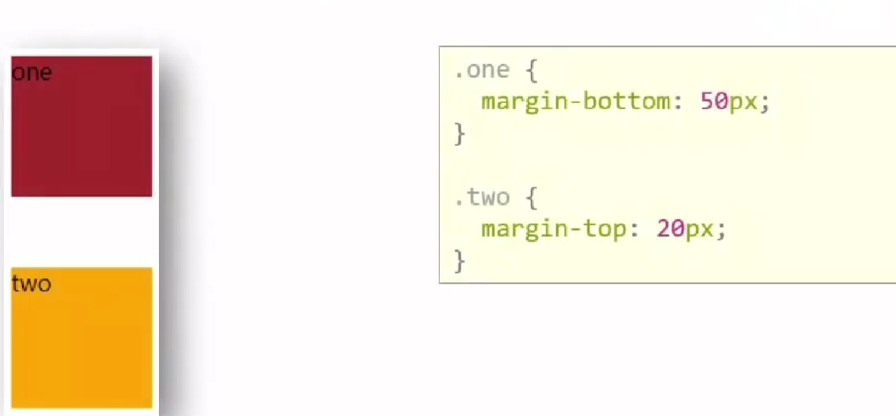{:width=200px height=200px}
此时两个盒子的上下间距为50px
2. 塌陷问题：父子级的标签，子级添加上外边距会使父级向下移动
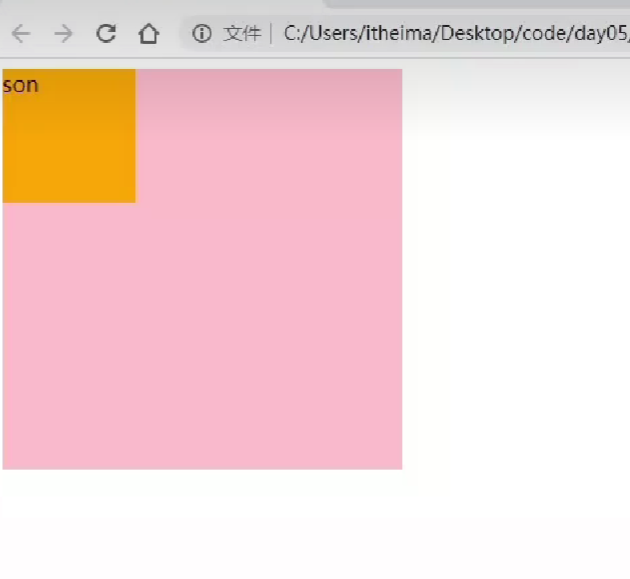{:width=200px height=200px}
如图，想设置子div在父级div内往下移动50px，但给子div加上`margin-top:50px;`后，发现子div与父级div相对位置不变，整体下移了50px
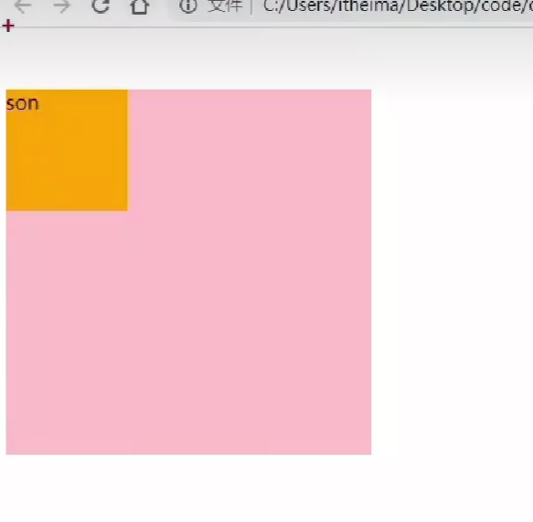{:width=200px height=200px}
解决办法：
    1. 取消子级margin设置，父级设置`padding-top:50px;` --**推荐使用**
    2. 子级仍设置`margin-top:50px;`，父级设置`overflow:hidden;` （原理是让浏览器找到父级元素的正确边界位置）
    3. 子级仍设置`margin-top:50px;`，父级设置`border-top:1px...;` （原理同上）--**不推荐使用**
    效果如图：
    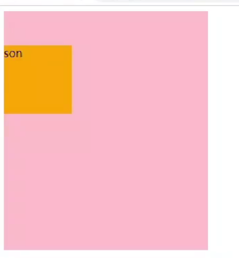{:width=200px height=200px}
3. 行内元素的内外边距问题
行内元素添加margin和padding，无法改变它的垂直位置
解决方法：改变它的`line-height`值
###### 圆角效果
`border-radius:px值或百分比` 属性值为圆角半径，一般都用px值
也可以传入多个值，从左上角开始顺时针赋值，没有取值的角与对角取值相同
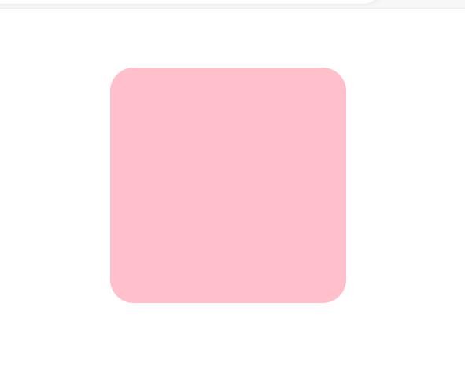{:width=100px height=100px}
常用的圆角：
- 正圆形状：给**正方形**盒子设置`border-radius:50%`或宽高的一半
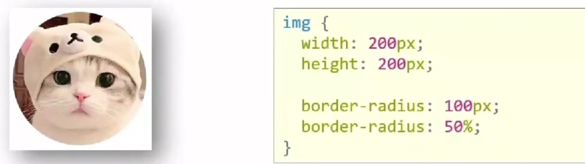{:width=100px height=100px}
注：圆角百分比最大为50%，多了也按50%算，因为这是最圆的情况
- 胶囊形状：给**长方形**盒子设置`border-radius:height/2`即盒子高度的一半
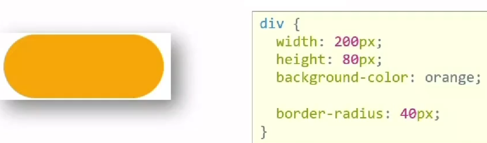{:width=100px height=100px}
###### 阴影效果
`box-shadow:X轴偏移量 Y轴偏移量 模糊半径 扩散半径 颜色 内外阴影`其中X轴偏移量、Y轴偏移量必须有；默认是外阴影（即在盒子外面显示阴影），内阴影属性值为`inset`（不常用）
如`box-shadow: 10px 15px 10px 1px rgba(0, 0, 0, 0.5);`效果：
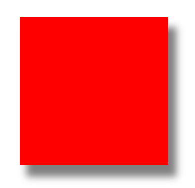{:width=100px height=100px}
X轴偏移量越大，阴影越往右；Y轴偏移量越大，阴影越往下；模糊半径越大，阴影越柔和；扩散半径越大，阴影范围越大
###### 盒子模型综合案例
例1：
{:width=100px height=100px}
```
<style>
    * { /*清除默认样式*/
        margin: 0;
        padding: 0;
        box-sizing: border-box;
    }
    body {
        background-color: #f1f1f1; /*更改网页背景色*/
    }
    .product {
        margin: 50px auto; /*竖直边距50px，水平居中*/
        padding-top: 40px; /*内容与边框距离40px*/
        width: 270px;
        height: 253px;
        background-color: white;
        text-align: center; /*文字/img居中*/
        border-radius: 10px; /*圆角效果*/
    }
    .product h4 {
        margin-top: 20px; /*与上面的间距为20px*/
        margin-bottom: 12px; /*与上面的间距为12px*/
        font-size: 18px;
        font-weight: 400;
        color: #333333;
    }
    .product p {
        font-size: 12px;
        color: #555;
    }
</style>
<body>
    <div class="product">
        
        <h4>抖音直播SDK</h4>
        <p>包含抖音直播看播功能</p>
    </div>
</body>
```
例2：
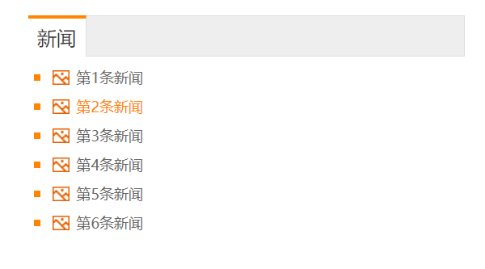{:width=150px height=150px}
观察效果可知，需要大盒子中包含一个标题栏和一个内容区域，内容部分使用无序列表和超链接
```
<style>
    /*清除默认样式*/
    * {
        margin: 0;
        padding: 0;
        box-sizing: border-box;
    }
    li{
        list-style: none; /*清除默认图标*/
    }
    a{
        text-decoration: none; /*清除下划线*/
    }
    .news{
        margin: 100px auto;
        width: 360px;
        height: 200px;
        background-color: white;
    }
    .news .head{
        height: 34px; /*只需设置高度即可，宽度继承大盒子*/
        background-color: #eee;
        border: 1px solid #dbdee1;
        border-left: 0; /*去掉左侧边框线*/
    }
    .news .head a{
        display: block; /*改成块元素，要不宽高不生效*/
        border-top: 3px solid #ff8400;
        border-right: 1px solid #dbdee1;
        margin-top: -1px; /*如果不将a标签往上移，a就会在.head边框线下，而我们想让a的边框与.head边框重合，因此移动一个边框的距离*/
        width: 48px;
        height: 34px;
        background-color: #fff;
        text-align: center; /*文字水平居中，注意是在a内设置，如果在.head设置就是让a标签水平居中了*/
        line-height: 32px; /*文字垂直居中，行高与height相同（根据边框和移动距离作微调）*/
        color: #333;
    }
    .news .content{
        padding: 5px; /*content标签与里面li的距离为5px*/
    }
    .news .content li{
        padding-left: 15px; /*li标签与a标签有15px左侧间距*/
        background: url(./盒子模型案例2_square.png) no-repeat;
        background-position: 0 center; /*图标在li的最左侧，垂直方向居中*/
    }
    .news .content li a{
        padding-left: 20px; /*a标签与a文字有20px左侧间距*/
        background: url(./盒子模型案例2_img.gif) no-repeat;
        background-position: 0 center; /*图标在a标签的最左侧，垂直方向居中*/
        font-size: 12px;
        color: #666;
        line-height: 24px;
    }
    .news .content li a:hover{ /*鼠标悬停效果*/
        color: #ff8400;
    }
</style>
<body>
    <div class="news">
        <div class="head"><a href="#">新闻</a></div>
        <div class="content">
            <ul>
                <li><a href="#">第1条新闻</a></li>
                <li><a href="#">第2条新闻</a></li>
                <li><a href="#">第3条新闻</a></li>
                <li><a href="#">第4条新闻</a></li>
                <li><a href="#">第5条新闻</a></li>
                <li><a href="#">第6条新闻</a></li>
            </ul>
        </div>
    </div>
</body>
```
难点--关于.content部分各标签的padding设置：
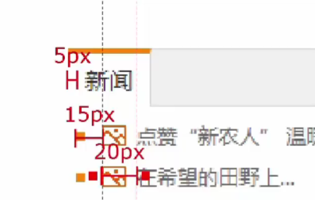{:width=100px height=100px}
### 显示模式--display
##### 块级元素
`<div>、<table>、<form>、<p>、<ul>、<h1>...<h6>、<hr>`等
- 独占一行
- 宽度默认是父级的100%
- 可以设置宽高属性
##### 行内元素
`<span>、<a>、<input>、<textarea>、<select>、<label>`
以及一些文本元素`<br>、<b>、<strong>、<sup>、<sub>、<i>、<em>、<del>、<u>`等
- 一行可以共存多个行内元素
- 尺寸由内容长度决定
- 不能设置宽高属性
##### 行内块元素
`<input>、`等，它们兼有块级和行内元素的特点
- 一行可共存多个
- 默认尺寸由内容长度决定
- 可以设置宽高属性
##### display
`display:属性值`更改指定标签的显示模式
| display属性值 | 效果           |
| ------------- | -------------- |
| block         | 改为块级元素   |
| inline-block  | 改为行内块元素 |
| inline        | 改为行内元素   |
| none          | 隐藏该元素     |

一般只使用block、inline-block和none
注意：`display:none`表示消除该元素，若其下有其他元素，就会上移到该空间区域
- 例1：
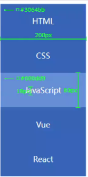{:width=250px height=250px}
如图所示，鼠标停留在对应标签时颜色改变
```
<style>
    a {
        display: block;/*更改显示模式，因为要独占一行*/
        width: 200px;
        height: 80px;
        background-color: #3064bb;
        color: white;
        text-decoration: none;/*去掉下划线*/
        text-align: center;/*文本水平居中*/
        line-height: 80px;/*将文本垂直居中，可以将行高设为与标签高度相同*/
        font-size: 18px;
    }
    a:hover {/*鼠标停留在a上时*/
        background-color: #608dd9;
        color: white;
    }
</style>
<body>
    <a href="#">HTML</a>
    <a href="#">CSS</a>
    <a href="#">JavaScript</a>
    <a href="#">Vue</a>
    <a href="#">React</a>
</body>
```
- 例2：
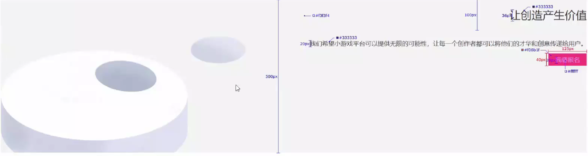{:width=500px height=200px}
```
<style>
    .banner {
        height: 500px;
        background-color: #f3f3f4;
        background: url(display实战_res.png) no-repeat left bottom;
        text-align: right;/*因为该div下的标签文本都是右对齐，所以只需在父级元素设置文本对齐属性即可（有继承性）*/
        color: #333;/*文字的颜色也有继承性，使用这些继承性可以简化代码*/
    }
    .banner h2 {
        font-size: 36px;
        font-weight: 400;
        line-height: 100px;/*行高*/
    }
    .banner p {
        font-size: 20px;
    }
    .banner a {
        width: 125px;
        height: 40px;
        background-color: #f06b1f;
        display: inline-block;/*不能是块级元素，因为块元素独占一行，不能让它去最右边*/
        text-align: center;
        line-height: 40px;/*水平垂直居中*/
        color: white;
        text-decoration: none;
        font-size: 20px;
    }
</style>
<body>
    <div class="banner">
        <h2>让创造产生价值</h2>
        <p>我们行为小游戏平台可以提供无限的可能性，让每一个创作者都可以将他们的才华和创意传递给用户</p>
        <a href="#">我要报名</a>
    </div>
</body>
```
### 伪元素选择器
作用：创建虚拟元素（伪元素），用来摆放装饰性的内容
| 伪元素选择器 | 说明                              |
| ------------ | --------------------------------- |
| E::before    | 在E元素里面的最前面添加一个伪元素 |
| E::after     | 在E元素里面的最后面添加一个伪元素 |

伪元素必须设置`content:""`属性用来设置内容，如果没有内容，引号内留空即可；伪元素默认是行内显示模式
```
<style>
    div {
        width: 300px;
        height: 300px;
        background-color: pink;
    }
    div::before {
        content: "我是before";/*不设定content就不会生效*/
        display: block;/*若要块级，必须显式进行设定*/
        width: 50px;
        height: 50px;
        background-color: red;
    }
    div::after {
        content: "我是after";
        display: inline-block;
        width: 50px;
        height: 50px;
        background-color: white;
    }
</style>
<body>
    <div>我是大的div</div>
</body>
```
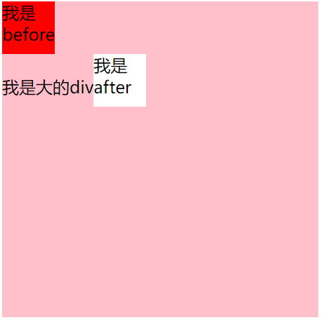{:width=200px height=200px}
### 元素溢出--overflow
作用：控制溢出元素的显示方式
`overflow:属性值`
| overflow属性值 | 说明                                       |
| -------------- | ------------------------------------------ |
| hidden         | 溢出隐藏                                   |
| scroll         | 溢出滚动（无论是否溢出，都显示滚动条位置） |
| auto           | 溢出滚动（溢出才显示滚动条位置）           |

滚动条包括水平和竖直方向的两条，auto时哪个溢出就显示哪个，scroll会都显示