<a id="mulu">目录</a>
<a href="#mulu" class="back">回到目录</a>
<style>
    .back{width:40px;height:40px;display:inline-block;line-height:20px;font-size:20px;background-color:lightyellow;position: fixed;bottom:50px;right:50px;z-index:999;border:2px solid pink;opacity:0.3;transition:all 0.3s;color:green;}
    .back:hover{color:red;opacity:1}
    img{vertical-align:bottom;}
</style>

<!-- @import "[TOC]" {cmd="toc" depthFrom=3 depthTo=6 orderedList=false} -->

<!-- code_chunk_output -->

- [平面转换transform](#平面转换transform)
    - [平移](#平移)
    - [旋转](#旋转)
    - [改变转换原点](#改变转换原点)
    - [多重转换](#多重转换)
    - [缩放](#缩放)
    - [倾斜](#倾斜)
    - [渐变](#渐变)
      - [线性渐变](#线性渐变)
      - [径向渐变](#径向渐变)
- [空间转换](#空间转换)
    - [平移](#平移-1)
    - [视距](#视距)
    - [旋转](#旋转-1)
    - [立体呈现](#立体呈现)

<!-- /code_chunk_output -->

<!-- 打开侧边预览：f1->Markdown Preview Enhanced: open...
只有打开侧边预览时保存才自动更新目录 -->

### 平面转换transform
平面转换也称2D转换，改变盒子在平面内的形态（位移、旋转、缩放、倾斜等），一般与过渡配合使用，从而为元素添加动态效果。
约定平面内坐标轴如图：
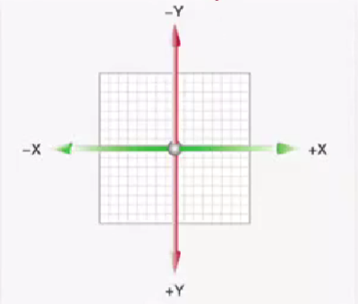{:width=150px height=150px}
即水平X轴正向为右侧，垂直Y轴正向为下侧
##### 平移
`transform:translate(X轴移动距离,Y轴移动距离)`
两个移动距离的取值：
- px单位
- 百分比（参照盒子自身尺寸）
- 可正可负

例：鼠标移入父盒子，子盒子改变位置
```
<style>
    .father {
        width: 500px;
        height: 300px;
        border: 1px solid black;
    }
    .son {
        width: 200px;
        height: 100px;
        background-color: pink;
        transition: all 0.5s;
    }
    .father:hover .son { /*父盒子hover，改变子盒子属性*/
        transform: translate(200px, 100px);
    }
</style>
<body>
    <div class="father">
        <div class="son">我是小盒子</div>
    </div>
</body>
```
效果：当鼠标进入父盒子后，子盒子移动；鼠标出父盒子，子盒子再移回原来的位置。
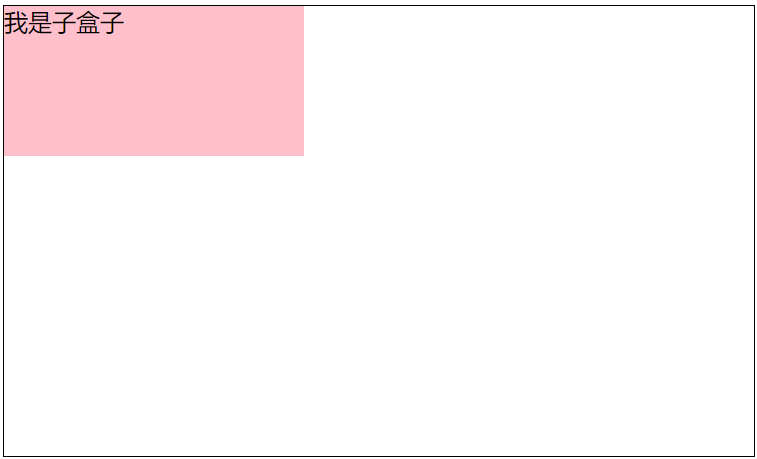{:width=100px height=100px} -> 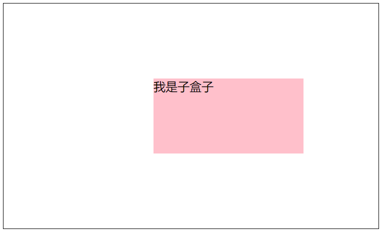{:width=100px height=100px}
其中`transform: translate(200px, 100px);`表示向右移动200px，向下移动100px，设置为负就是往反方向；
`transform: translate(50%, 100%);`表示向右移动自身宽度的50%，向下移动自身高度的100%，设置为负就是往反方向；
***
`translate()`也可以只传入一个值，表示沿X轴移动的距离，取值同上；
也可以单独设置X和Y轴移动距离：`translateX()`和`translateY()`，取值同上。
***
例：双开门效果--两张图片横向放置：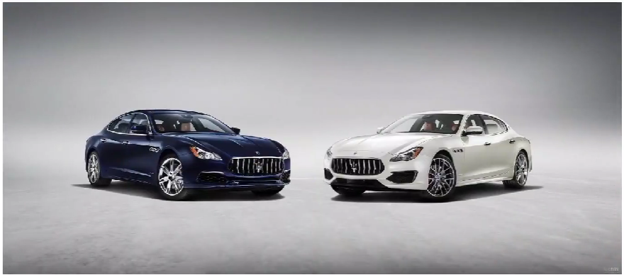{:width=50px height=50px}
鼠标放上去时，两张图片分别向左/右移动：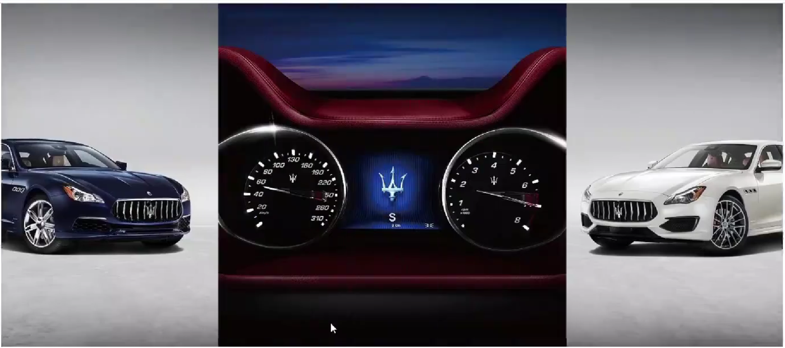{:width=50px height=50px}
最后显示出下层图片：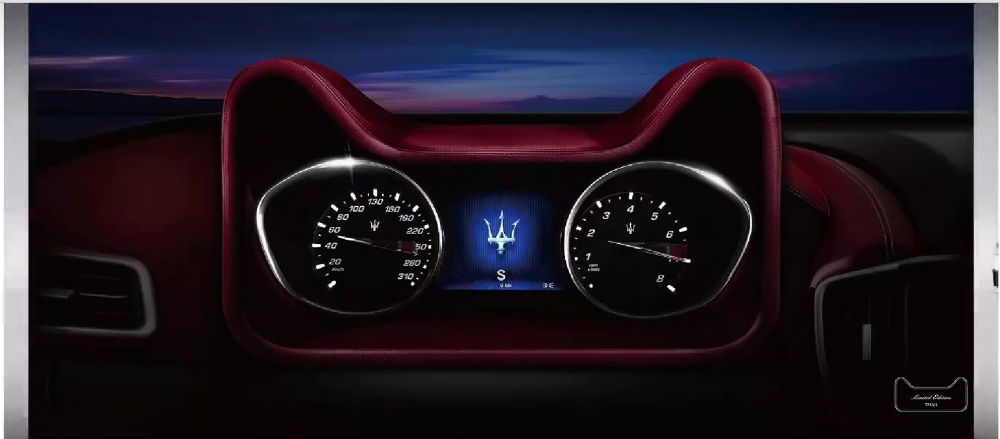{:width=50px height=50px}
鼠标移走后图片又自动恢复原来的状态。
布局：父子结构，父级是下层的大图，子级是上层的两张小图。初始状态下子级图片会自动覆盖父级图片。
其中两张小图的资源图片是精灵图，即尺寸与大图相同，能正好覆盖两个小盒子，需要设置右子盒子的background-position，使它显示精灵图的右半部分
```
<style>
    *{
        margin: 0;
        padding: 0;
    }
    .box {
        display: flex; /*弹性布局，自动使两张小图左右排列*/
        margin: 50px auto; /*水平居中*/
        width: 1366px;
        height: 600px;
        background-image: url(./bg.jpg);
        overflow: hidden; /*超出部分隐藏，让移动后两张小图超出大图的部分消失*/
    }
    .box .left,
    .box .right{
        width: 50%; /*宽度是父级的一半*/
        height: 100%; /*高度与父级相同*/
        background-image: url(./fm.jpg);
        transition: all .5s; /*.5s相当于0.5s*/
    }
    .box .right{
        background-position: right 0; /*right表示取图片的右侧，0就是上下位置不变*/
    }
    .box:hover .left{
        transform: translate(-100%); /*往左移动一倍的自身宽度*/
    }
    .box:hover .right{
        transform: translateX(100%); /*往右移动一倍的自身宽度*/
    }
</style>
<body>
    <div class="box">
        <div class="left"></div>
        <div class="right"></div>
    </div>
</body>
```
##### 旋转
`transform:rotate(旋转角度)`
角度单位是`deg`（就是°），取值正负均可，**正--顺**时针旋转、**负--逆**时针旋转。
常与transition联用，以形成旋转的动画。
如`transform:rotate(360deg)`就是顺时针旋转一圈
##### 改变转换原点
默认情况下，所有转换的原点都是盒子中心点，如旋转是绕中心旋转。
有些时候需要改变转换原点，如时钟的秒/分/时针就是以端点为旋转中心：
`transform-origin:水平原点位置 垂直原点位置`
取值：
- 方位名词(left top right bottom center)
- px
- 百分比

常用方位名词，如`transform-origin:right bottom`表示以图片（盒子）的右下角端点旋转
***
例：时钟，已有初始状态如下
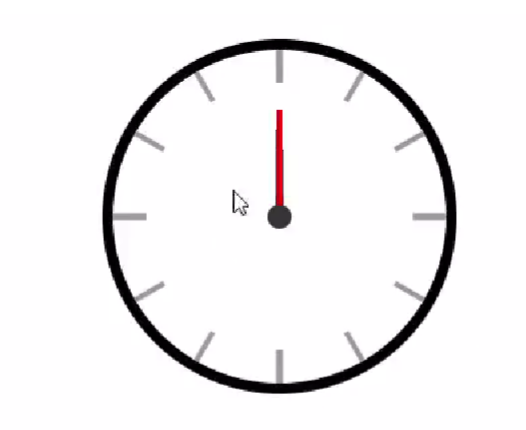{:width=100px height=100px}
需要将三根表针以它们的正下端旋转：
```
transform-origin: center bottom; /*改变转换原点*/
transform: rotate(360deg);
transition: all 60s; /*转一圈60s*/
```
[查看源码](./时钟.html)
##### 多重转换
即同时进行平移和旋转
注意：要先平移再旋转
`transform:translate() rotate()`
例：滚动的轮胎
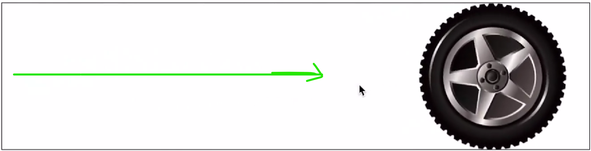{:width=70px height=70px}
设大盒子宽度为800px，轮胎宽度200px，则滚动距离应为600px
```
img{
    transition: all 5s;
}
.box:hover img {
    transform: translate(600px) rotate(360deg);
}
```
[查看源码](./滚动的轮胎.html)
***
为什么必须先平移再旋转：
`transform`以第一种转换形态的坐标轴为准，而旋转会改变坐标轴方向，而`translate(600px)`是以x轴为平移方向，x轴方向改变，平移方向也改变，导致图片螺旋运动。
为什么不能分开写两个`transform`属性：
旋转平移都是transform属性，后面的transform会覆盖前面的。
##### 缩放
实现图片放大效果：正常状态下--
{:width=150px height=150px}
当鼠标移到图片上时--
{:width=150px height=150px}
（鼠标移出时图片复原）
使用：`transform:scale(缩放倍数)`表示XY轴均按此倍数等比例缩放，也可单独设置：
`transform:scale(X轴缩放倍数,Y轴缩放倍数)`
取值大于1表示放大，小于1表示缩小，等于1则不变；
默认以中心点为原点进行缩放
```
.box {
    overflow: hidden; /*超出部分隐藏，保证总大小不变*/
}
.box img {
    transition: all 0.5s;
}
.box:hover img {
    transform: scale(1.1); /*放大1.1倍
}
```
[查看源码](./缩放.html)
如果使用width和height进行设置，则是图片以左上角为原点缩放，向右下方扩大，不好看
***
例：播放效果--鼠标进入大图片时，播放按钮显示到图片中间；移出时按钮放大并消失。
效果：
初始状态{:width=75px height=75px}
当鼠标移到图片上时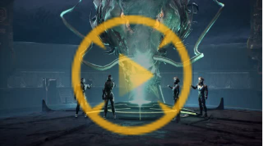{:width=75px height=75px}->{:width=75px height=75px}
分析：按钮是悬浮在图片之上的，所有使用子绝父相，同时居中定位；在居中定位时，使用`margin`设置最好，若使用`translate`需要为hover前后都添加该属性，要不`transform`会覆盖；
关于缩放效果：初始状态播放按钮处于放大并隐藏状态，当移到图片上时，按钮缩小并显示。
核心代码：
```
.pic {
    position: relative; /*子绝父相--悬浮效果*/
    overflow: hidden; /*超出部分不可见*/
}
.pic::after { /*使用伪元素的背景图片放置按钮*/
    position: absolute; /*子绝父相--悬浮效果*/
    left: 50%;
    top: 50%;
    /* transform: translate(-50%, -50%); 居中定位，为避免transform覆盖与缩放写到一起*/
    content: ''; /*伪元素必须设置content:""属性用来设置内容*/
    opacity: 0; /*初始状态下不可见*/
    width: 58px;
    height: 58px;
    background-image: url(./images/play.png);
    transform: translate(-50%, -50%) scale(5);
    transition: all .5s;
}
.box li:hover .pic::after {
    transform: translate(-50%, -50%) scale(1);
    opacity: 1;
}
```
[查看源码](./按钮缩放.html)
##### 倾斜
`transform:skew(倾斜角度)`
角度单位是`deg`（就是°），取值正负均可，**正--向左**倾斜、**负--向右**倾斜。
如`transform: skew(30deg);`：
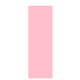{:width=75px height=75px}->{:width=75px height=75px}
##### 渐变
多个颜色逐渐变化的效果，一般用于设置盒子背景
分为线性渐变（从一端向另一端）{:width=75px height=75px}
和径向渐变（从中心向四周）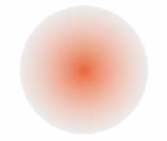{:width=75px height=75px}
###### 线性渐变
`background-image: linear-gradient(渐变方向,颜色1 终点位置1,颜色2 终点位置2,...)`
表示从`终点位置1`到`终点位置2`是`颜色1`到`颜色2`的渐变,...
- 渐变方向：可选，取值为`to 方位名词`或角度度数；默认从上到下竖直方向，若为`to right`就是从左到右
- 终点位置：可选，取值为百分比；默认按传入的颜色数均分

```
background-image: linear-gradient(
    45deg,
    red 80%,
    green
);
```
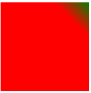{:width=75px height=75px}
```
background-image: linear-gradient(
    to right,
    red,
    green
);
```
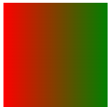{:width=75px height=75px}
***
例：为图片添加渐变背景，使图片下部的文字更加清晰
{:width=75px height=75px}->{:width=75px height=75px}
```
.mask { /*单独设置一个盒子作渐变，之后把盒子加到图片上*/
    position: absolute;
    left: 0;
    top: 0;
    width: 100%;
    height: 100%; /*把盒子加到图片上，绝对定位（子绝父相）、位置靠左上、宽高同父级*/
    background-image: linear-gradient(
        transparent, /*透明色*/
        rgba(0,0,0,0.5) /*半透明黑色*/
    );
}
```
[查看源码](./线性渐变产品展示.html)
###### 径向渐变
`background-image: radial-gradient(半径 at 圆心水平位置 圆心垂直位置,颜色1 终点位置1,颜色2 终点位置2,...)`
- 半径可以为2条，此时为椭圆
- 圆心位置取值：像素单位数值/百分比/方位名词

```
.box {
    width: 100px;
    height: 100px;
    background-color: pink;
    border-radius: 50%;
}
```    
1. 
    ```
    background-image:radial-gradient(
            50px at center center, /*在正中心(水平垂直方向的中心)画一个R=50的圆*/
            red, /*圆心是red*/
            pink /*四周是pink*/
            );
    ```
    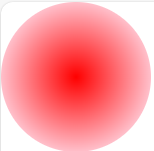{:width=75px height=75px}
2. 
    ```
    background-image: radial-gradient(
    50px 20px at 50px 30px,
        red,
        pink 50%
    );
    ```
    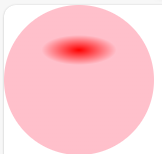{:width=75px height=75px}
3. 为按钮添加高光效果：
    ```
    button {
    width: 100px;
    height: 40px;
    background-color: green;
    border: 0;
    border-radius: 5px;
    color: white;
    }
    ```
    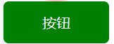{:width=50px height=50px}
    添加
    ```
    background-image: radial-gradient(
    50px at 50px 20px,
    rgba(255, 255, 255, 0.5),
    transparent
    );
    ```
    {:width=50px height=50px}
### 空间转换
相比平面转换，多了一条Z轴，方向与视线方向相同，即Z轴垂直于屏幕，Z轴正向指向用户（屏幕向外）。因此空间转换也叫3D转换
##### 平移
`transform: translate3d(x,y,z)`xyz分别为向对应轴平移的距离，可以是像素单位数值，也可以是百分比（参照盒子自身尺寸）。注意必须传入3个参数
如`transform: translate3d(100px,200px,300px);`，因为电脑屏幕是平面，所以只使用平移函数时看不到Z轴的平移效果
上述代码等效于`transform: translateX(100px) translateY(200px) translateZ(300px);`
##### 视距
指定了观察者与Z=0平面的距离，为元素添加透视效果。
效果：近大远小、近实远虚
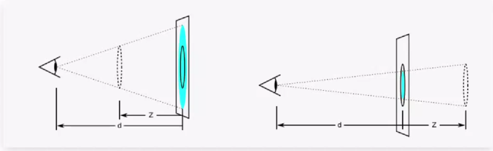{:width=150px height=150px}
`perspective:视距值`添加给**直接父级**，一般视距值取800-1200px
```
.father {
    width: 100px;
    height: 100px;
    perspective: 800px; /*父级设置视距*/
    border: 2px solid black;
}
.son {
    width: 100px;
    height: 100px;
    background-color: pink;
}
.son:hover {
    transform: translateZ(-300px);
}

<div class="father">
    <div class="son"></div>
</div>
```
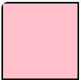{:width=100px height=100px}->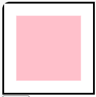{:width=100px height=100px}
可以看到子盒子变小，因为`translateZ(-300px)`表示远离人眼，若是`translateZ(300px)`则子盒子放大。
规律：**同样的位移下，视距越小，变化就越大**
##### 旋转
`transform: rotateZ(角度值)`因为Z轴穿过图片的中心点，所以它等效于[平面旋转](#旋转)
***
`transform: rotateX(角度值)`沿横向轴旋转，如`transform: rotateX(60deg)`：
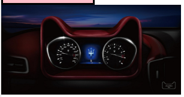{:width=100px height=100px}->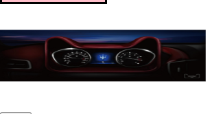{:width=100px height=100px}
角度值为正数时图片上端向屏幕内转，反之外转
为父级元素添加透视属性，可以更清晰地查看图片是向哪个方向旋转：
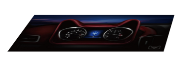{:width=100px height=100px}
上边较短，说明上端向屏幕内转
***
`transform: rotateY(角度值)`沿纵向轴旋转；角度值为正数时图片右端向屏幕内转，反之外转
如设置`transform: rotateY(60deg)`和透视时的效果：
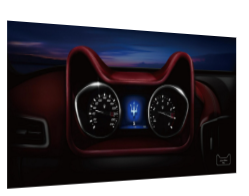{:width=100px height=100px}
***
左手法则--根据旋转方向确定取值正负：左手握住旋转轴，拇指指向轴的正方向，其它四指弯曲方向即为旋转正值方向
***
**不常用**：`rotate3d(x,y,z,角度)`用来设置自定义旋转轴的位置及旋转角度，其中xyz取值为0-1
##### 立体呈现
设置某个元素的子元素是位于3D空间中还是平面中
`transform-style:属性值`
属性值：
- `flat`:默认值，子级处于平面中
- `preserve-3d`:子级处于3D空间

呈现立体图形的步骤：
- 父元素设置`transform-style:preserve-3d`
- 子级定位（子绝父相）
- 调整子盒子的位置（位移/旋转）

```
.cube {
    width: 200px;
    height: 200px;
    margin: 100px auto;
    transform-style: preserve-3d; /*父元素设置立体呈现*/
    position: relative; /*子绝父相*/
    transform: rotateY(-30deg) rotateX(-30deg); /*旋转父盒子，使效果更清晰*/
}
.cube div {
    position: absolute; /*子绝父相*/
    left: 0;
    top: 0; /*与父元素位置重合*/
    width: 200px;
    height: 200px;
    opacity: 0.7;
}
.front {
    background-color: yellow;
    transform: translateZ(100px); /*前面盒子向前移100px*/
}
.back {
    background-color: green;
    transform: translateZ(-100px); /*后面盒子向后移100px*/
}
<div class="cube">
    <div class="front">前面</div>
    <div class="back">后面</div>
</div>
```
没有设置立体呈现时：
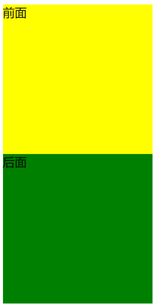{:width=200px height=200px}
设置后：
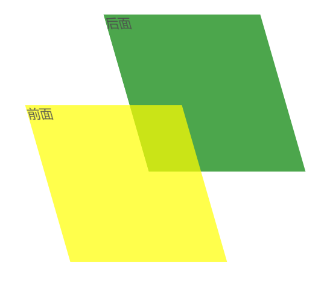{:width=200px height=200px}
***
例：3D翻转
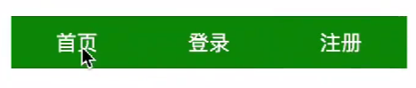{:width=50px height=50px}->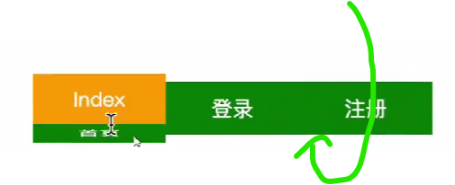{:width=100px height=100px}
思路：
- 搭建立方体：绿色是前面，橙色是上面
- 定位两个面
    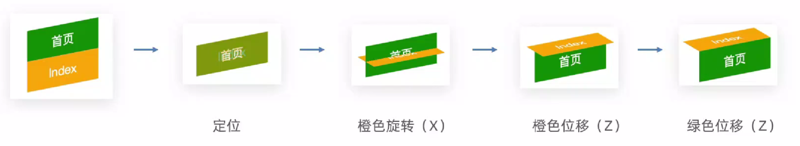{:width=100px height=100px}
- 鼠标悬停后旋转

初始状态下：
```
<div class="nav">
  <ul>
    <li>
      <a href="#">首页</a>
      <a href="#">Index</a>
    </li>
    <li>
      <a href="#">登录</a>
      <a href="#">Login</a>
    </li>
    <li>
      <a href="#">注册</a>
      <a href="#">Register</a>
    </li>
  </ul>
</div>
```
{:width=50px height=50px}
核心代码：
```
.nav li {
  position: relative; /*子绝父相*/
  transition: all 0.5s; /*翻转动画*/
  transform-style: preserve-3d; /*父元素设置立体呈现*/
  /* transform: rotateX(-20deg) rotateY(30deg); 为了看到橙色和绿色的移动过程，给立方体添加旋转*/
}
.nav li a {
  position: absolute; /*子绝父相*/
  left: 0;
  top: 0; /*与父元素位置重合*/
}
.nav li a:first-child { /*绿色盒子*/
  transform: translateZ(20px); /*绿色Z轴平移*/
}
.nav li a:last-child { /*橙色盒子*/
  transform: rotateX(90deg) translateZ(20px); /*橙色X轴旋转 Z轴平移*/
}
.nav li:hover {
  transform: rotateX(-90deg);
}
```
注意：**立方体每个面都有单独的坐标轴体系**。
在判断橙色面的位移时，我们应该面向橙色，因此{:width=50px height=50px}实际上是橙色面Z轴的位移；
而{:width=50px height=50px}实际上是绿色面Z轴的位移。
[查看源码](./3D翻转.html)