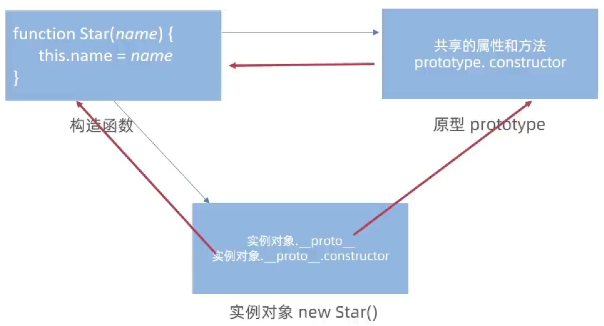
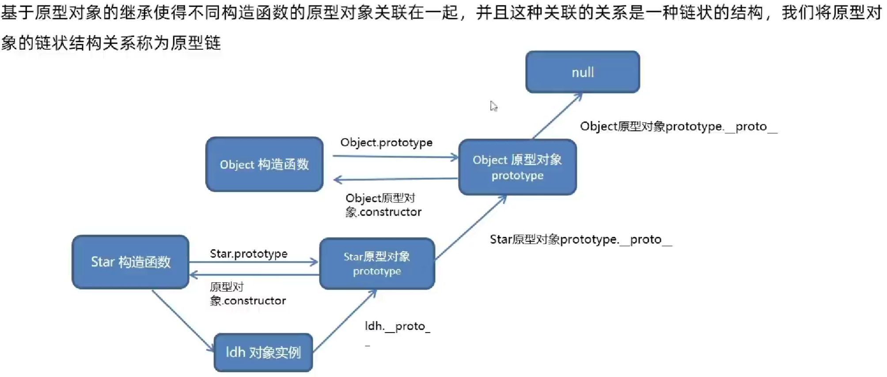

<a id="mulu">目录</a>
<a href="#mulu" class="back">回到目录</a>
<style>
    .back{width:40px;height:40px;display:inline-block;line-height:20px;font-size:20px;background-color:lightyellow;position: fixed;bottom:50px;right:50px;z-index:999;border:2px solid pink;opacity:0.3;transition:all 0.3s;color:green;}
    .back:hover{color:red;opacity:1}
    img{vertical-align:bottom;}
</style>

<!-- @import "[TOC]" {cmd="toc" depthFrom=3 depthTo=6 orderedList=false} -->

<!-- code_chunk_output -->

- [闭包](#闭包)
- [展开运算符](#展开运算符)
- [函数的剩余参数](#函数的剩余参数)
- [箭头函数](#箭头函数)
    - [写法](#写法)
    - [this](#this)
- [解构](#解构)
    - [数组解构](#数组解构)
    - [对象解构](#对象解构)
- [深入对象](#深入对象)
    - [基础概念](#基础概念)
    - [Object静态方法](#object静态方法)
    - [原型](#原型)
      - [原型对象](#原型对象)
      - [constructor属性](#constructor属性)
      - [对象原型](#对象原型)
    - [原型继承](#原型继承)
    - [原型链](#原型链)
- [递归函数](#递归函数)
- [深浅拷贝](#深浅拷贝)
    - [浅拷贝](#浅拷贝)
    - [深拷贝](#深拷贝)
- [其它补充](#其它补充)
    - [JS中语句必须加分号的两种情况](#js中语句必须加分号的两种情况)
    - [保留小数](#保留小数)

<!-- /code_chunk_output -->

<!-- 打开侧边预览：f1->Markdown Preview Enhanced: open...
只有打开侧边预览时保存才自动更新目录 -->

### 闭包
**变量查找机制**：函数执行时会优先查找当前函数作用域中变量，若当前作用域查不到会依次逐级查找父级作用域中变量，直到全局作用域。
这种机制也称**作用域链**，确保子作用域可以访问父作用域，但父作用域无法访问子作用域
**闭包**：内层函数使用外层函数的变量，作用是将变量封闭在函数内，避免变量污染（被重新声明或误修改），同时外部可以通过特殊方式操作函数内变量
缺点是可能引起内层泄露（程序分配的内存由于某种原因没释放/无法释放），因为外层函数内变量可能不会被释放
**基本形式：**
```js
function outer() {
    let a = 10; //外层函数的变量
    function inner() { //内层函数
        console.log(a); //可以对外层函数的变量进行操作
    }
    return inner; //必须将内层函数返回，以便在全局操作
}
const inner_func = outer(); //即内层函数
inner_func(); //10
```
**应用--统计函数调用次数：**
最简单的写法：
```js
let count = 0;
function func(){
    count++;
    console.log(`函数调用了${count}次`);
}
func();
```
采用这种方法可以实现目的，但count是全局变量，易被修改
闭包的形式：
```js
function outer(){
    let count = 0; //实现了count这个变量的私有
    function func(){
        count++;
        console.log(`函数调用了${count}次`);
    }
    return func;
}
const fn = outer();
fn(); //调用内层func函数
```
在函数外无法访问count变量，只有通过调用`fn()`的方式才能使`count++`
### 展开运算符
`...`展开运算符，可以将一个数组展开，且不改变原数组，返回数组的各个元素，一般用于给接收非数组的函数传参
```js
const arr = [1,2,3];
console.log(...arr); //1  2  3
//等同于
console.log(1,2,3);
//求数组中元素最大值
console.log(Math.max(...arr)); //Math.max必须接收数值型变量
//等同于
console.log(Math.max(1,2,3));
```
合并数组：
```js
const arr1 = [1,2,3];
const arr2 = [4,5,6];
const arr_merge = [...arr1,...arr2]; //等同于
const arr_merge = [1,2,3,4,5,6];
```
### 函数的剩余参数
前面已经介绍过函数的动态参数：当不确定传给函数几个实参时，使用函数的`arguments`参数获得传入的实参，它是一个伪数组，包含传入的实参，并且只存在于函数中
求出所有实参之和：
```js
function getSum() {
    let sum = 0;
    for (let i = 0; i < arguments.length; i++) {
        sum += arguments[i];
    }
    return sum;
}
```
函数的剩余参数：使用形参`...变量名`来接收传入的实参，该变量是一个数组，里面元素为传入的实参
```js
function func(...other) {
    console.log(other); //使用的时候不需要写...
}
func(1, 1, 2); //(3) [1, 1, 2]
```
与`arguments`的区别在于：剩余参数之前还可以定义形参，此时剩余参数就是有定义形参后传入的实参
```js
function func(a, b, ...other) {
    console.log(other);
}
func(1, 1); //[]
func(1, 1, 2, 3, 4); //(3) [2, 3, 4]
```
建议使用剩余参数，因为它更加灵活，而且是真数组
### 箭头函数
更简洁的函数写法，且不绑定this，适用于需要使用匿名函数的地方
##### 写法
- 正常情况下：`函数名 = (形参1,形参2,...) => {函数体}`
    ```js
    const func = (a,b) => {
        console.log(a,b);
    };
    //相当于
    function func(a,b){
        console.log(a,b);
    }
    func(1,2); //1 2
    ```
- 当只有1个形参时可以省略小括号：`函数名 = 形参 => {函数体}`
    ```js
    const func = a => {
        console.log(a);
    };
    ```
- 当只有1行代码时可以省略大括号：`函数名 = (形参1,形参2,...) => 函数语句`，且这行代码会被自动作为返回值返回
    ```js
    const func = a => console.log(a);
    func(1); //1
    const func = a => a + a;
    console.log(func(1)); //2
    ```
    特殊情况：当省略大括号且返回一个对象时，必须在对象的大括号外面加上小括号
    ```js
    const func = function (uname) {
        return { uname: uname };
    };
    //相当于
    const func = (uname) => ({uname:uname});
    console.log(func('abc')); //{uname: 'abc'}
    ```
    如果不加`{}`外的小括号，就无法分清是函数体的`{}`还是对象的`{}`，因此要加小括号

例1：阻止表单的默认行为
```js
const form = document.querySelector('form');
form.addEventListener('submit',e => e.preventDefault());
//相当于
form.addEventListener('submit',function(e){
    e.preventDefault();
});
```
例2：对传入函数的参数求和
```js
const getSum = (...arr) => {
    let sum = 0;
    for (let i = 0; i < arr.length; i++) {
        sum += arr[i];
    }
    return sum;
}
console.log(getSum(1, 2, 3)); //6
```
##### this
正常函数this都是指调用它的对象，而箭头函数不会创建自己的this，只会从自己作用域链的上一层沿用this
```js
const func = () => {
    console.log(this);
};
func(); //window
```
之所以是window，不是因为它调用了`func`函数，而是因为`func`函数作用域的上一级作用域内（全局作用域）内的this就是指window
```js
const obj = {
    name:'abc',
    say_hi:()=>{
        console.log(this);
    }
};
obj.say_hi(); //window
const obj1 = {
    name:'abc',
    say_hi:function(){
        const func = () =>{
            console.log(this);
        }
    }
};
obj1.say_hi(); //obj
```
对于obj：因为`say_hi`在`obj`作用域内，所以`say_hi`的this指向与`obj`内this指向相同，`obj`是window对象，所以this是window
对于obj1：`func`的this应指向匿名函数`function`中的this，而它是一个正常函数，this就是调用它的对象`obj`
**总结**：箭头函数没有自己的this指向，它的this指向上一级作用域的this（根据作用域链），因此在箭头函数中要谨慎使用this来指代某个对象
在对DOM的操作中，因为有时用this指向标签，所以不推荐在DOM事件中使用箭头函数；原型、构造函数中也不推荐使用
```js
const btn = document.querySelector('button');
btn.addEventListener('click',function() {
    console.log(this); //btn
});
btn.addEventListener('click',() => {
    console.log(this); //window
});
```
在上面的例子中，我们本希望用this指代事件的触发者`btn`，但箭头函数中的this却指向了window
### 解构
##### 数组解构
即将数组的单元值批量赋值给变量
```js
const [a,b,c] = [1,2,3]; //解构赋值
console.log(a,b,c); //1  2  3
```
相当于：
```js
const arr = [1,2,3];
const a = arr[0];
const b = arr[1];
const c = arr[2];
```
也可接收返回数组的函数：
```js
function getvalue(){
    return[10,20];
}
const [a,b] = getvalue();
```
交换2个变量的值：
```js
[a,b] = [b,a];
```

---

特殊情况：
- 值少变量多：多的变量为undefined
    ```js
    const [a,b,c] = [1,2];
    console.log(a,b,c); //1  2  undefined
    ```
    设置默认值可解决该问题：
    ```js
    const [a=0,b=0,c=0] = [1,2]; //0是abc的默认值，当右侧没有值给它们时，会遵循默认值
    console.log(a,b,c); //1  2  0
    ```
- 变量少值多：多的值被忽略
    ```js
    const [a,b] = [1,2,3];
    console.log(a,b); //1  2
    ```
    剩余参数可解决该问题：
    ```js
    const [a,...arr] = [1,2,3,4];
    console.log(a,arr); //1  (3)[2,3,4]
    ```
- 按需导入赋值：不想接收就空着
    ```js
    const [a,,c] = [1,2,3]; //没有变量接收2这个值
    console.log(a,b,c); //1  2  3
    ```
- 支持多维数组解构
    ```js
    const [a,c] = [1,[2,3]];
    console.log(a,c); //1  (2)[2,3]
    const [a1,[b1,b2]] = [1,[2,3]];
    console.log(a1,b1,b2); //1  2  3
    ```
##### 对象解构
即将对象属性方法快速赋值给变量
```js
const obj = {
    name:'abc',
    age:20
};
const {name,age} = obj;  
console.log(name,age); //'abc'  20
```
相当于
```js
const name = obj.name;
const age = obj.age;
```
注意：对象解构时**用于接收的变量名**必须与**属性名**相同，不相同的变量会成为undefined
如果解构时已经有了与属性名相同的变量名，可以使用  `属性名:新变量名`  的方式
```js
const {name:obj_name,age:obj_age} = {name:'abc',age:20};
console.log(obj_name,obj_age); //'abc'  20
```
可以只接收其中一部分属性：
```js
const obj = {
    name:'abc',
    gender:'男',
    age: 20
};
const {gender} = obj;
console.log(gender); //男
```

---

数组对象解构：
```js
const obj = [
    {
        name:'abc',
        age:20
    }
];
const [{name,age}] = obj;
```
多级对象解构：
```js
const obj = {
    name: {
        first: 'abc',
        last: 'ABC'
    },
    age: 20
};
const { name: { first, last }, age } = obj;
console.log(first, last, age); //'abc'  'ABC'  20
```

---

应用：当后台传入一个含很多属性的对象，而处理函数只需用到其中一个属性时
```js
const data = {
    code:200,
    ......
};
function render({code}){
    console.log(code); 
}
render(data); //200
```
相当于
```js
function render(data){
    const {code} = data;
    console.log(code); 
}
```
### 深入对象
##### 基础概念
**实例化**：使用`new`关键字调用构造函数的行为，实例化构造函数时若没参数传入可省略函数后的`()`
**实例化执行过程**：
- `new`创建新的空对象`object`
- 构造函数中的`this`指向该对象
- 执行构造函数代码，修改`this`，添加新的属性
- 将修改后的新对象返回

**实例成员**：通过构造函数创建的对象称为**实例对象**，实例对象中的属性方法称为实例成员/方法。实例对象是相互独立互不干扰的，所以实例成员/方法也是独立的
**静态成员**：构造函数的属性/方法，只能通过构造函数来访问，静态方法中的`this`指向构造函数，如`Date.now()`、`Math.PI`等
```js
function Person(name) { //构造函数
    this.name = name;
}
Person.eyes = 2; //静态属性
Person.sayHi = function () { //静态方法
    console.log(this);
}
Person.sayHi(); //ƒ Person(name) { this.name = name;} 即Person的构造函数
const p = new Person('abc'); //实例对象
p.age = 20; //实例属性--中存在于这个实例对象中，其它实例对象没有该属性
```
##### Object静态方法
- `Object.keys(obj)`获得obj所有的属性名（以数组形式返回）
- `Object.values(obj)`获得obj所有的属性值（以数组形式返回）
- `Object.assign(des,src)`给des对象添加src的属性。若des对象为空，可看成将src对象拷贝给des对象

```js
const a = {
    'name':'abc',
    'age':20
};
console.log(Object.keys(a)); //(2) ['name', 'age']
console.log(Object.values(a)); //(2) ['abc', 20]
const a_copy = {};
Object.assign(a_copy,a); //将a对象拷贝给a_copy
console.log(a_copy); //{name: 'abc', age: 20}
const a_add = {
    'gender':'男',
    'height':180
};
Object.assign(a,a_add); //将a_add添加到a对象中
//Object.assign(a,{'gender':'男','height':180}); 也可以
console.log(a); //{name: 'abc', age: 20, gender: '男', height: 180}
```
##### 原型
###### 原型对象
每一个构造函数都有一个`prototype`属性，它表示一个对象，称为**原型对象**，即构造函数的原型（对象）
这个对象可以挂载函数，当构造函数实例化时不会多次构建函数，节约内存
因此可以把一些不变的方法直接定义在`prototype`上，这样所有实例都可以使用这些方法
注意：构造函数和原型对象中this都指向实例化的对象
总之，在使用构造函数创建类时：公共属性写到构造函数内，公共方法写到构造函数原型里
```js
function Person(name,age){
    this.name = name;
    this.age = age; //name和age是公共属性
}
Person.prototype.sayhi=function(){ //sayhi是公共方法
    console.log(this.name);
};
const p1 = new Person('abc',20);
const p2 = new Person('ABC',22);
p1.sayhi(); //abc
p2.sayhi(); //ABC
console.log(p1.sayhi===p2.sayhi); //true
```
例：给数组扩展求最大值方法以及求和方法，使任意数组实例对象都可使用->定义到Array原型上
```js
Array.prototype.max = function () {
    return Math.max(...this);
};
Array.prototype.sum = function () {
    return this.reduce((prev, item) => prev + item);
};
const arr = [2, 1, 4, 5, 3, 3, 5];
console.log(arr.max()); //5
console.log(arr.sum()); //23
```
注意：因为`Array.prototype.func`是直接在`window`下使用的，所以不能用箭头函数来作为`Array.prototype.func`的接收值，因为这样箭头函数的`this`将指向`window`，而不是当前作用域中的`Array`对象
```js
//错误写法
Array.prototype.max = () => Math.max(...this);
```
###### constructor属性
是原型对象里面的一个属性，指向该原型对象的构造函数，用来标识一个原型对象属于哪个构造函数
```js
function Person(name, age) {
    this.name = name;
    this.age = age;
}
console.log(Person.prototype.constructor); //ƒ Person(name,age){this.name=name;this.age=age;}
console.log(Person.prototype.constructor === Person); //true
```
使用场景：当我们想给原型对象添加很多个方法时，例如
```js
Person.prototype.sing=()=>console.log("sing");
Person.prototype.dance=()=>console.log('dance');
```
可以直接写成：
```js
Person.prototype={
    sing:()=>console.log('sing'),
    dance:()=>console.log('dance')
};
```
但这样写会产生问题，因为第二种方法是直接给原型对象赋值而不是追加，因此会覆盖它的`constructor`属性，使得原型对象无法找到它对应的构造函数。可以这样解决：
```js
Person.prototype={
    constructor:Person, //重新指回构造函数
    sing:()=>console.log('sing'),
    dance:()=>console.log('dance')
};
```
###### 对象原型
在每个**实例**对象里都有一个属性`__proto__`，指向构造函数的原型对象
之所以实例对象可以使用原型对象的属性方法，就是因为对象有`__proto__`这个属性
有些浏览器会用`[[prototype]]`来表示对象原型
`__proto__`是只读属性，用来表明当前实例对象指向哪个原型对象，其中也有一个`constructor`属性指向该实例对象的构造函数（因为`__proto__`指向`prototype`，`prototype`里面有`constructor`属性）
```js
function Person(name, age) {
    this.name = name;
    this.age = age;
}
const p1 = new Person('abc', 20);
console.log(p1.__proto__); //{constructor: ƒ}
console.log(p1.__proto__ === Person.prototype); //true
```
这些属性使得构造函数、构造函数的实例对象、构造函数的原型对象三者联系在一起：
{:width=300 height=300}
##### 原型继承
即将公共属性添加到想继承这些属性的构造函数的原型对象上
```js
const Person = {
    eyes: 2,
    mouth: 1
};
function Student(school) {
    this.school = school;
}
Student.prototype = Person; //Student通过原型继承Person
Student.prototype.constructor = Student; //指回原来的构造函数（必须加，要不constructor属性被覆盖）
Student.prototype.go_school = () => console.log('goschool'); //给Student添加方法
function Adult(work) {
    this.work = work;
}
Adult.prototype = Person; //Adult通过原型继承Person
Adult.prototype.constructor = Adult;
Adult.prototype.go_work = () => console.log('gowork'); //给Adult添加方法
console.log(Adult.prototype, Student.prototype); //它们是相同的，都有go_work和go_school两个方法
```
因为`Adult.prototype`和`Student.prototype`都指向`Person`，给它们添加属性就相当于给`Person`添加属性，所以它们是相同的
然而我们不想让这两个子构造函数有相同的属性方法（`Student`应只有`go_school`、`Adult`应只有`go_work`），可以让`Student`和`Adult`继承`Person`类的两个不同实例对象
```js
function Person() {
    this.eyes = 2;
    this.mouth = 1;
}
function Student(school) {
    this.school = school;
}
Student.prototype = new Person(); //Student通过原型继承Person的一个实例对象
Student.prototype.constructor = Student; 
Student.prototype.go_school = () => console.log('goschool'); 
function Adult(work) {
    this.work = work;
}
Adult.prototype = new Person(); //Adult通过原型继承Person的另一个实例对象
Adult.prototype.constructor = Adult;
Adult.prototype.go_work = () => console.log('gowork');

const s1 = new Student('school');
const a1 = new Adult('work');
console.log(s1, a1); //现在就达到了想要的效果
```
`s1`有`eyes mouth school go_school()`，`a1`有`eyes mouth work go_work()`
总之，原型继承可表示为：
- 父构造函数（父类）
- 子构造函数（子类）
- 子类的原型 = new 父类
##### 原型链
JS中最基本的构造函数是`Object()`，所有对象都是`Object()`的一个实例化对象，包括我们自己创建的构造函数的原型对象
`Object`及其原型对象是整个原型链的最根部：
{:width=300 height=300}
```js
function Person(){}
console.log(Person.prototype.__proto__===Object.prototype); //true
console.log(Object.prototype.__proto__); //null
```
原型链的查找规则：
- 当访问一个对象的属性方法时，首先查找这个对象自身有没有该属性方法；
- 如果没有就查找它的原型(也就是`__proto__`指向的`prototype`原型对象)；
- 如果还没有就查找原型对象的原型(`Object`的原型对象)；
- 依此类推一直找到`Object`(`null`)为止。

`__proto__`对象原型的意义就在于为对象成员查找机制提供一个方向，或者说一条路线
使用`对象 instanceof 构造函数名`检查一个对象是否为一个类的实例：
```js
function Person() { }
const p = new Person();
console.log(p instanceof Person); //true
console.log(p instanceof Array); //false
console.log([] instanceof Array); //true
```
所有对象都是`object`的子类，任何`对象 instance of Object`都返回`true`
### 递归函数
即函数内部调用自己，若想让递归函数执行有限次则必须要有终止条件
例：通过递归使用`setTimeout`函数模拟`setInterval`的效果--每隔1s刷新时间显示
```js
const li = document.querySelector('li');
function show_time() {
    li.innerHTML = new Date().toLocaleString();
    setTimeout(show_time, 1000); 
    //在1s后启动定时器，再次执行该函数，达到循环的效果
}
show_time();
```
### 深浅拷贝
一个简单的例子：创建对象`a`，之后`let b = a;`，更改`b`的属性，则`a`属性也会跟着改变
因为`b = a`实际是把`a`地址给`b`，它们都指向同一块内存，改变一个就会改变另一个
##### 浅拷贝
即拷贝对象第一层属性的值
将src内容拷贝到des中：
- 使用展开运算符：`des={...src};`
- 使用对象的`assign`方法：
    ```js
    des={}; 
    Object.assign(des,src);
    ```

```js
const obj = {
    'name': 'abc',
    'age': 20
};
const o = {};
Object.assign(o, obj);
//或const o = {...obj};
o.age = 18;
console.log(o.age); //18
console.log(obj.age); //20
```
可以看到改变一个对象的属性，另一个不会更改
问题：如果对象里面还有对象，则内层对象还是拷贝的地址，改变一个会改变另一个
```js
const obj = {
    'person': {
        age: 20
    }
};
const o = { ...obj };
o.person.age = 18;
console.log(o.person.age); //18
console.log(obj.person.age); //18
```
即浅拷贝只针对第一层拷贝值，因为内层对象的值是它的地址，拷贝内层对象时仍然是拷贝地址，所以会出现这个问题
##### 深拷贝

### 其它补充
##### JS中语句必须加分号的两种情况
- 立即执行函数后`(function(){})();`
- 如果一条语句以`[]`数组开头，该语句的前面要加分号
    ```js
    let [a,b]=[1,2]; //必须加分号
    [b,a]=[a,b];
    let str = 'a'; //必须加分号
    [1,2,3].map(function(){});
    ```
##### 保留小数
`num.toFixed(小数位数)`
若num小数点后位数<传入的位数则用0补齐，保留时遵循四舍五入的原则
```js
const num = 10;
console.log(num.toFixed(2)); //10.00
const num1 = 1.456;
console.log(num1.toFixed(1)); //1.5
```
注意：不能直接写`10.toFixed(2)`