<a id="mulu">目录</a>
<a href="#mulu" class="back">回到目录</a>
<style>
    .back{width:40px;height:40px;display:inline-block;line-height:20px;font-size:20px;background-color:lightyellow;position: fixed;bottom:50px;right:50px;z-index:999;border:2px solid pink;opacity:0.3;transition:all 0.3s;color:green;}
    .back:hover{color:red;opacity:1}
    img{vertical-align:bottom;}
</style>

<!-- @import "[TOC]" {cmd="toc" depthFrom=3 depthTo=6 orderedList=false} -->

<!-- code_chunk_output -->

- [基础概念](#基础概念)
    - [顶级对象](#顶级对象)
    - [DOM对象和jQuery对象](#dom对象和jquery对象)
    - [入口函数](#入口函数)
- [基本使用](#基本使用)
    - [选择器](#选择器)
      - [基础选择器](#基础选择器)
      - [筛选选择器](#筛选选择器)
      - [父/子/兄弟选择器](#父子兄弟选择器)
    - [排他思想](#排他思想)
    - [链式编程](#链式编程)
    - [样式操作](#样式操作)
      - [css()](#css)
      - [设置标签的类](#设置标签的类)
- [动画效果](#动画效果)
    - [显示隐藏](#显示隐藏)
    - [滑动显示隐藏](#滑动显示隐藏)
    - [淡入淡出](#淡入淡出)
    - [事件切换](#事件切换)
    - [停止动画](#停止动画)
    - [自定义动画](#自定义动画)
- [属性操作](#属性操作)
    - [设置/获取元素的固有属性](#设置获取元素的固有属性)
    - [设置/获取元素的自定义属性](#设置获取元素的自定义属性)
    - [数据缓存](#数据缓存)
    - [全选按钮案例](#全选按钮案例)
    - [内容文本值](#内容文本值)
      - [普通元素内容innerHTML](#普通元素内容innerhtml)
      - [普通元素文本内容innerText](#普通元素文本内容innertext)
      - [表单值value](#表单值value)
- [元素操作](#元素操作)
    - [遍历](#遍历)

<!-- /code_chunk_output -->

<!-- 打开侧边预览：f1->Markdown Preview Enhanced: open...
只有打开侧边预览时保存才自动更新目录 -->

### 基础概念
##### 顶级对象
`$`是`jQuery`的别称，在代码中它们是等价的，但一般为了方便都使用`$`。
`$`是jQuery库中顶级对象，相当于原生JS中的window，使用`$`将元素转为jQuery对象，进而使用jQuery库的方法
##### DOM对象和jQuery对象
使用原生JS获取的对象是DOM对象，用jQuery函数获取的对象是jQuery对象，本质上是用`$`把DOM对象进行封装
```
const div_dom = document.querySelector('div'); //DOM对象
const div_jquery = $('div'); //jquery对象
console.log(div_dom); //div.box
console.log(div_jquery); //ce.fn.init {0: div.box, length: 1, prevObject: ce.fn.init}
```
注意：jQuery对象只能使用jQuery库中的属性方法，DOM对象只能使用原生JS的属性方法
***
这两种对象有时需要相互转换：原生JS比jQuery更大，原生JS的一些属性方法jQuery没有
- DOM->jQuery：`$(DOM对象)`
    ```
    const div_dom = document.querySelector('div'); //DOM对象
    const div_jquery = $(div_dom); //jquery对象
    ```
- jQuery->DOM：`jQuery对象[index]`或`jQuery对象.get(index)`其中index为索引号，因为jQuery对象是一个伪数组，可以通过索引获取其中的元素
    ```
    const div_jquery = $('div'); //jquery对象
    let div_dom = div_jquery[0]; //因为只有1个div，所以index=0
    div_dom = div_jquery.get(0);
    div_dom.style.display = 'none';
    ```
##### 入口函数
如果想在HTML标签前写入JS，就需要等待页面DOM元素加载完成后执行代码，可以使用jQuery的入口函数：
- `$(function(){ /*要执行的代码*/ });`
- `$(document).ready(function(){ /*要执行的代码*/ });`

相当于原生JS中的DOMContentLoaded，但这个事件是等页面文档、外部JSCSS文件、图片等都加载完成才触发；
而jQuery提供的这种方式是等DOM结构渲染完成就可执行，不必等所有外部资源都加载，因此效率更高执行更快。
### 基本使用
##### 选择器
###### 基础选择器
`$('CSS选择器')`：其中选择器形式与`document.querySelector('CSS选择器')`相同，如
- `$('*')`选中全部元素
- `$('div')`标签选择器
- `$('.box')`类选择器
- `$('#back')`id选择器
- `$('div,p,li')`并集选择器
- `$('div.box')`交集选择器
- ...

注意：jQuery选择器默认选中全部符合条件的元素，将这些元素存入伪数组中，可以通过索引获取，类似于`document.querySelectorAll()`
***
**隐式迭代**：当使用jQuery对象进行更改标签CSS样式等操作时，jQuery库函数会自动遍历jQuery对象进行更改，不需我们写循环手动迭代，如：
```
//有4个div标签，需要改变它们的样式
$('div').css("background","pink");
```
###### 筛选选择器
| 筛选选择器 | 用法            | 描述                                                |
| ---------- | --------------- | --------------------------------------------------- |
| :first     | `$('li:first')` | 获取第一个li                                        |
| :last      | `$('li:last')`  | 获取最后一个li                                      |
| :eq(index) | `$('li:eq(2)')` | 在获取到的li中，选择索引号为2的元素（index从0开始） |
| :odd       | `$('li:odd')`   | 在获取到的li中，选择索引号为奇数的元素              |
| :even      | `$('li:even')`  | 在获取到的li中，选择索引号为偶数的元素              |

可与基础选择器联用，如`$('ul li:first')`就是选中ul标签下的第1个li。以下提到的所有选择器都是可以联用的
###### 父/子/兄弟选择器
| 父/子/兄弟选择器   | 用法                             | 描述                                                                                      |
| ------------------ | -------------------------------- | ----------------------------------------------------------------------------------------- |
| parent()           | `$("li").parent()`               | 查找父级                                                                                  |
| parents(selector)  | `$("li").parents()`              | 查找li的所有父级                                                                          |
| children(selector) | `$("ul").children("li")`         | 相当于`$("ul>li")`，选择最近**子级**的li                                                  |
| find(selector)     | `$("ul").find("li")`             | 相当于`$("ul li")`，**后代**选择器（包括所有子孙元素）                                    |
| siblings(selector) | `$(".first").siblings("li")`     | 选中所有符合selector的兄弟节点，不包括自己本身                                            |
| nextAll([expr])    | `$(".first").nextAll()`          | 查找当前元素之后所有的同辈元素                                                            |
| prevtAll([expr])   | `$(".last").prevAll()`           | 查找当前元素之前所有的同辈元素                                                            |
| hasClass(class)    | `$('div').hasClass("protected")` | 检查当前的元素是否含有某个特定的类，如果有则返回true                                      |
| eq(index)          | `$("li").eq(2)`                  | 相当于`$("li:eq(2)")`，index从0开始 ，更推荐这种方法，因为`2`写到引号外，可用变量直接替代 |

常用`parent()` `children()` `find()` `siblings()` `eq()`
##### 排他思想
例：有多个按钮，点击其中一个按钮就让它改变背景颜色，其它按钮去掉背景颜色
```
$('button').click(function () { //隐式迭代，给所有的按钮都绑定了点击事件
    $(this).css('background', "pink"); //点击的元素改变背景颜色
    $(this).siblings('button').css('background', ""); //它其它的兄弟按钮清除背景颜色
});
```
相比于原生JS的排他思想，不仅写法更简单，而且也不用额外添加初始状态有无active类的判断
***
另一个案例：鼠标经过左侧盒子中某个小li，就让右侧内容区盒子显示相对应的图片，其它图片隐藏。
分析：
1. 需得到当前li的索引号，使用jq中的`$(this).index()`方法
2. 通过eq(index)方法选择图片展示
3. jq提供了显示隐藏函数`show()`和`hide()`不需操作CSS样式

```
$("#left li").mouseover(function () { //鼠标经过左侧的小li 
    $(this).css('background', "pink"); //经过的小li改变背景颜色
    $(this).siblings('li').css('background', ""); //它其它的li清除背景颜色
    const index = $(this).index(); //获取当前小li的索引号
    $("#content div").eq(index).show(); //右侧的盒子相应索引号的图片显示出来
    $("#content div").eq(index).siblings().hide(); //让其余的图片（就是其他的兄弟）隐藏起来
});
```    
[查看案例源码](./10-1-tab栏切换-1/淘宝精品服饰案例.html)
##### 链式编程
jq中有一些函数（如改变元素CSS样式的`css()show()hide()`等）返回它的调用者，如`$(this).css()`返回`$(this)`，这使得我们可用在`css()`之后继续调用`$(this)`。
可以将多条以同个jq对象开头的语句合为一句，如上面例子中的：
```
$("#content div").eq(index).show();
$("#content div").eq(index).siblings().hide();
```
它们都以`$("#content div").eq(index)`这个jq对象开头，于是可以写成：
```
$("#content div").eq(index).show().siblings().hide();
```
其中`$("#content div").eq(index).show()`返回`$("#content div").eq(index)`，给`siblings().hide()`继续调用。
同理，
```
    $(this).css('background', "pink"); //经过的小li改变背景颜色
    $(this).siblings('li').css('background', ""); //它其它的li清除背景颜色
```
也可以写成：
```
$(this).css('background', "pink").siblings('li').css('background', "");
```
注意：链式编程可以减少代码量，但应在保证代码可读性的前提下进行
##### 样式操作
###### css()
`jq对象.css('属性名','属性值')`
1. 参数只写属性名时，返回属性值（以字符串形式）
    如`$('div').css('width')`返回div的宽度
2. 参数中的属性名/值以`,`分隔，其中属性名必须加引号;
属性值如果是数字可以不写引号，如果是以px为单位的像素值也可以省略引号和px，如`css('width', 100)`就是修改宽度为100px
3. 参数可以是对象（字典）的形式，`css({'属性名1':'属性值1','属性名2':'属性值2'})`属性名/值用`:`隔开，每组样式用','隔开，属性名可以不加引号，属性值规定同上。
注意：当属性名不加引号时，复合属性必须用驼峰命名法（同原生JS）`'background-color'`->`backgroundColor`。
如：`$('div').css({ width: 100, 'height': 100, backgroundColor: 'red' });`
###### 设置标签的类
相当于原生JS中的`classList`，注意类名前不要加`.`
1. 添加类：`jq对象.addClass("类名")`
2. 删除类：`jq对象.removeClass("类名")`
    ```
    $('div').click(function () { //点击后变为active状态
        $(this).addClass('active');
    });
    $('div').dblclick(function () { //双击后变为正常状态
        $(this).removeClass('active');
    });
    ```
3. 切换类：`jq对象.toggleClass("类名")`如果有就去掉该类，如果没有就加上
    ```
    $('div').click(function () { //点击后切换状态
    $(this).toggleClass('active');
    });
    ```
***
例：tab栏切换
```
$(".tab_list li").click(function () {
    $(this).addClass("current").siblings().removeClass("current"); //当前li添加current类，其余兄弟移除类
    const index = $(this).index(); //得到当前li的索引号
    $(".tab_con .item").eq(index).show().siblings().hide(); //让下部里面相应索引号的item显示，其余的item隐藏
});
```
[查看案例源码](./10-1-tab栏切换-2/16-tab栏切换.html)
***
jq中类操作与className的区别：
原生JS中`className="xxx"`会覆盖原有的类名，而`addClass`是追加类名，不影响原有类名
### 动画效果
##### 显示隐藏
显示：`jq对象.show(speed,easing,fn)`
隐藏：`jq对象.hide(speed,easing,fn)`
切换显示/隐藏状态：`jq对象.toggle(speed,easing,fn)`，即如果初始是显示状态就隐藏，隐藏状态就显示。
参数都可以省略，无参数时直接显示。
- `speed`:取值为表示显示速度的字符串`"slow"`,`"normal"`,`"fast"`或表示动画时长的毫秒数值(如`1000`)
- `easing`:用来指定切换效果，默认是`"swing"`,可用参数`"linear"`
- `fn`:回调函数，在动画完成时执行的函数，每个元素执行一次

```
$('button').eq(0).click(function () {
    $('div').hide("normal", "linear", function () { alert('div隐藏'); });
});
```
效果：向左上角收缩同时颜色变淡，当div完成隐藏弹出提示框：
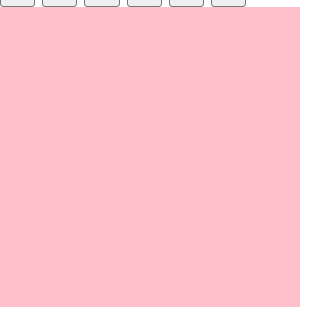{:width=75 height=75}->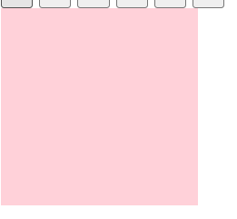{:width=75 height=75}->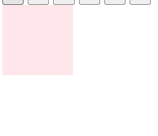{:width=75 height=75}
这3个函数支持链式调用；一般情况下都不加参数，直接进行显示隐藏即可。
##### 滑动显示隐藏
效果与上面不同，颜色不变淡，垂直方向拉伸：
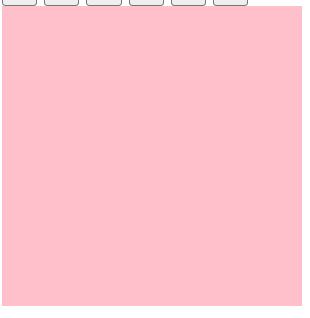{:width=75 height=75}->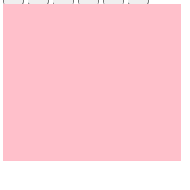{:width=75 height=75}->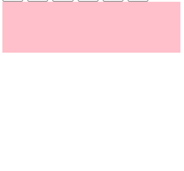{:width=75 height=75}
下滑显示：`jq对象.slideDown(speed,easing,fn)`
上拉隐藏：`jq对象.slideUp(speed,easing,fn)`
切换显示/隐藏状态：`jq对象.slideToggle(speed,easing,fn)`
参数与[显示隐藏](#显示隐藏)相同：
- 参数都可以省略，无参数时直接显示。
- `speed`:取值为表示显示速度的字符串`"slow"`,`"normal"`,`"fast"`或表示动画时长的毫秒数值(如`1000`)
- `easing`:用来指定切换效果，默认是`"swing"`,可用参数`"linear"`
- `fn`:回调函数，在动画完成时执行的函数，每个元素执行一次
##### 淡入淡出
效果：
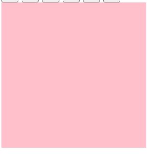{:width=75 height=75}->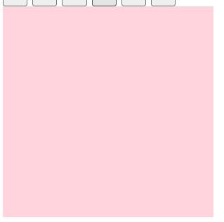{:width=75 height=75}->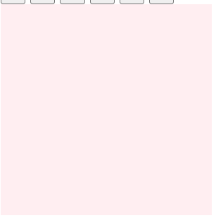{:width=75 height=75}
淡入：`jq对象.fadeIn(speed,easing,fn)`
淡出：`jq对象.fadeOut(speed,easing,fn)`
切换显示/隐藏状态：`jq对象.fadeToggle(speed,easing,fn)`
渐进方式调整到指定的不透明度：`jq对象.fadeTo(speed,opacity,easing,fn)`，其中`opacity`为想调整到的透明度，取值为0-1，**必须写**
其它参数与[显示隐藏](#显示隐藏)相同：
- 参数都可以省略，无参数时直接显示。
- `speed`:取值为表示显示速度的字符串`"slow"`,`"normal"`,`"fast"`或表示动画时长的毫秒数值(如`1000`)
- `easing`:用来指定切换效果，默认是`"swing"`,可用参数`"linear"`
- `fn`:回调函数，在动画完成时执行的函数，每个元素执行一次

例：高亮效果--当鼠标放到其中一张图片上，其它图片变暗
```
$("li").hover(function(){ //鼠标进入，其它li的透明度改成0.5，使这张图片相对较亮
    $(this).siblings().stop().fadeTo(400,0.5); 
},function(){ //鼠标离开，其它li的透明度恢复正常
    $(this).siblings().stop().fadeTo(400,1);
});
```
##### 事件切换
`jq对象.hover(over,out)`表示鼠标移动到元素上执行over函数(相当于mouseenter事件)，移出元素时执行out函数(相当于mouseleave事件)；也可以只传入一个函数，当鼠标经过/离开时都会执行该函数。
例：简洁版滑动下拉菜单--当鼠标移动到对应的li上时它的子列表下滑显示，移出后上拉隐藏；
原来的写法是分别为它添加鼠标经过和离开事件；新写法可以用hover函数实现：
```
$("li").hover(function(){
    $(this).children('ul').slideDown(200);
},function(){
    $(this).children('ul').slideUp(200);
});
```
更简单的写法：
```
$("li").hover(function(){
    $(this).children('ul').slideToggle(200);
});
```
##### 停止动画
动画/效果一旦被触发就会执行，如果多次触发，就会有多个动画/效果排队执行。如上面例子中每个动画都需要0.2s来执行，当快速经过/离开元素时，显示隐藏的动画就会不断触发，产生“延时”的效果。
`jq对象.stop()`方法用于停止该元素的动画/效果，把它写到动画/效果的**前面**，相当于停止**上一次**的动画。
对上一个例子的改进：
```
$("li").hover(function(){
    $(this).children('ul').stop().slideToggle(200);
});
```
可以看到，该函数支持链式调用
##### 自定义动画
`animate(params,[speed],[easing],[fn])`
`params`为必选参数，以对象形式传递`(属性名,属性值)`；属性名可以不加引号，若是复合属性需用驼峰命名法；属性值若为数字可不加引号，为字符串需要加。
其它参数与[显示隐藏](#显示隐藏)相同：
- 可以省略，无参数时直接显示。
- `speed`:取值为表示显示速度的字符串`"slow"`,`"normal"`,`"fast"`或表示动画时长的毫秒数值(如`1000`)
- `easing`:用来指定切换效果，默认是`"swing"`,可用参数`"linear"`
- `fn`:回调函数，在动画完成时执行的函数，每个元素执行一次

```
$('button').eq(0).click(function () {
    $('div').animate({
        marginLeft: 100, //向右移动100px
        color: 'red', //改变颜色
        opacity: 0.5 //改变不透明度
    }, 500);
});
```
***
例：卡片堆叠--手风琴效果
每个图片有展示和缩略两种状态，当鼠标移到图片上时图片变为展示状态，如：
{:width=100 height=50}
{:width=100 height=50}
在HTML中采用一个li中包含2张图片的方式：
{:width=100 height=50}
初始状态所有的小图都显示，所有的大图都隐藏；只有第一张图被设为current类，大图显示，小图隐藏
分析：当鼠标放入li时，该li的宽度变长，同时小图片消失，大图片显示；同时其它li的宽度变为正常状态
```
$(".king li").mouseenter(function () {
    $(this).stop().animate({ //选中的li
        width: 224, //改变宽度
    }).find(".small").stop().fadeOut().siblings(".big").stop().fadeIn(); //其中的小图片small淡出，它的兄弟元素大图片big淡入
    $(this).siblings("li").stop().animate({ //其它的li
        width: 69 //改变宽度
    }).find(".small").stop().fadeIn().siblings(".big").stop().fadeOut();
});
```
[查看案例源码](./10-2手风琴卡片堆叠/index.html)
### 属性操作
##### 设置/获取元素的固有属性
固有属性就是元素本身自带的属性，如`<a>`里面的`href`、`<input>`里面的`type`
`jq对象.prop("属性名")`返回它对应的属性值
`jq对象.prop("属性名","属性值")`设置属性值
```
<a href="#" title="test">a标签</a>
<script>
    $("a").prop("title", "new test"); //更改a的title属性
    console.log($("a").prop("title")); //new test
</script>
```
##### 设置/获取元素的自定义属性
自定义属性包括H5新增的`data-`系列和其它非固有属性
`jq对象.attr("属性名")`返回它对应的属性值
`jq对象.attr("属性名","属性值")`设置属性值
```
<div data-index="0"></div>
<script>
    console.log($("div").prop("data-index")); //undefined 自定义属性不能通过prop获取
    $("div").attr("data-index", "1"); //修改自定义属性
    console.log($("div").attr("data-index")); //1
</script>
```
##### 数据缓存
`data()`方法可以在指定的元素上存储数据，但不会改变DOM元素本身，刷新页面后存放的数据被删除
`jq对象.data("属性名","属性值")`设置属性值
`jq对象.data("属性名")`返回它对应的属性值
```
<button>1</button>
<script>
    $("button").eq(0).data("name", "abc"); //在第一个button元素上存放"name":"abc"
    console.log($("button").eq(0).data("name")); //abc  获取存取的数据
</script>
```
此时HTML中第一个button元素仍为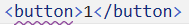{:width=20 height=20}
***
除此之外，这个方法还可以获取H5新增的`data-`系列自定义属性
注意这个方法获取`data-`系列自定义属性时，不用加前缀`data-`，如`data-xxx:`--`jq对象.data("xxx")`
```
<div data-index="0"></div>
<script>
    $("div").data("index", "1"); //修改自定义属性
    console.log($("div").data("index")); //1
</script>
```
##### 全选按钮案例
点击全选按钮，下面的三个小按钮全部改为选中状态，再次点击就都取消；若三个小按钮都选中，则全选按钮自动变为选中状态。
利用一个特别的选择器:`$("input:checked")`获取所有选中的多选框
- 全选按钮模块--三个多选框状态与全选相同
    ```
    $(".checkall").change(function () { //当全选按钮状态改变时
        const is_checked = $(this).prop("checked"); //checked属性是固有属性
        $(".check").prop("checked", is_checked); //隐式迭代，都会改变
    });
    ```
- 三个小按钮模块--点击多选框时判断：如果被选中的个数==3就把全选按钮选中，否则就不选中
    ```
    $(".check").change(function () { //当多选框按钮状态改变时
        if ($(".check:checked").length == $(".check").length) { //如果被选中的个数==全部个数
            $(".checkall").prop("checked", true); //选中全选按钮
        }
        else {
            $(".checkall").prop("checked", false);
        }
    });
    ```

[查看案例源码](全选按钮案例.html)
##### 内容文本值
###### 普通元素内容innerHTML
`jq对象.html()`获取元素的内容
`jq对象.html("new_content")`设置元素的内容
```
<div>
    <p>old</p>
</div>
<script>
    $("div").html("<p>new</p>");
    console.log($("div").html()); //<p>new</p>
</script>
```
###### 普通元素文本内容innerText
`jq对象.text()`获取元素的文本内容
`jq对象.text("new_content")`设置元素的内容
```
<div>
    <p>old</p>
</div>
<script>
    console.log($("div").text()); //old
    $("div").text("new"); //此时页面元素变为<div>new<div>
    console.log($("div").text()); //new
</script>
```
###### 表单值value
`jq对象.val()`获取表单的内容
`jq对象.val("new_content")`设置表单的内容
```
<input type="text" value="请输入内容">
<script>
    $("input").val("请输入新内容");
    console.log($("input").val()); //请输入新内容
</script>
```
### 元素操作
##### 遍历
jq中隐式迭代是对所有元素进行同一操作，如果想给每个元素作不同操作，就需要用到遍历
`jq对象.each(function(index,DOMele){})`
- 回调函数中index为元素对应的索引号，DOMele是每个元素对象，注意虽然是jq对象的each方法，但回调函数中却使用DOM对象。若想对DOMele使用jq方法，需要将它转换成jq对象`$(DOMele)`

```
div*3
<script>
    const color_arr = ["red", "green", "blue"];
    $("div").each(function (index, domEle) {
        $(domEle).html(`我是第${index + 1}个div`);
        $(domEle).css("backgroundColor", color_arr[index]);
    });
</script>
```
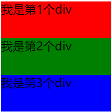{:width=150 height=150}
***
jq中还提供遍历数组、对象等数据类型的方式：
`$.each(obj,function(index,element){})`
- obj是要遍历的变量，回调函数中index为元素对应的索引号，element是变量中的每个元素

```
const color_arr = ["red", "green"];
$.each(color_arr, function (index, ele) { //可以遍历数组
    console.log(`第${index + 1}个颜色:${ele}`);
}); 
//第1个颜色:red  第2个颜色:green

const obj = { "name": "abc", "age": 20 };
$.each(obj, function (key, value) { //也可以遍历对象，此时第一个参数是属性名，第二个参数是属性值
    console.log(`${key}:${value}`);
}); 
//name:abc  age:20
```
