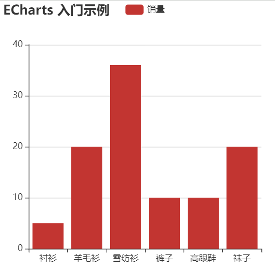
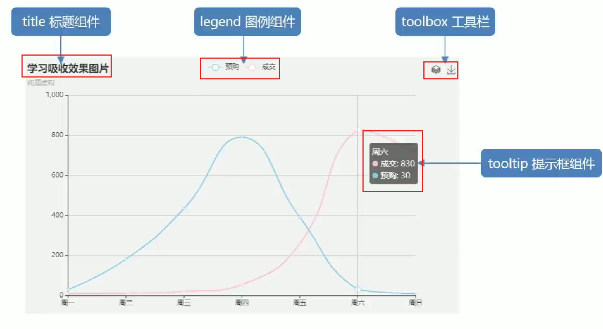
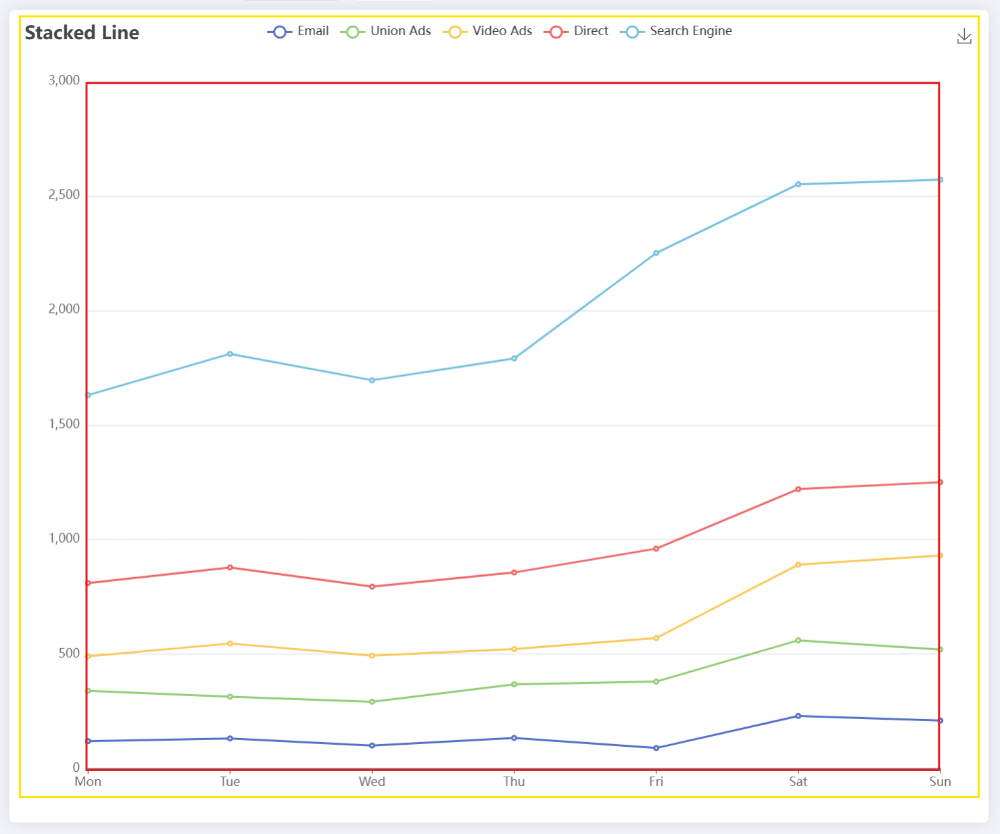
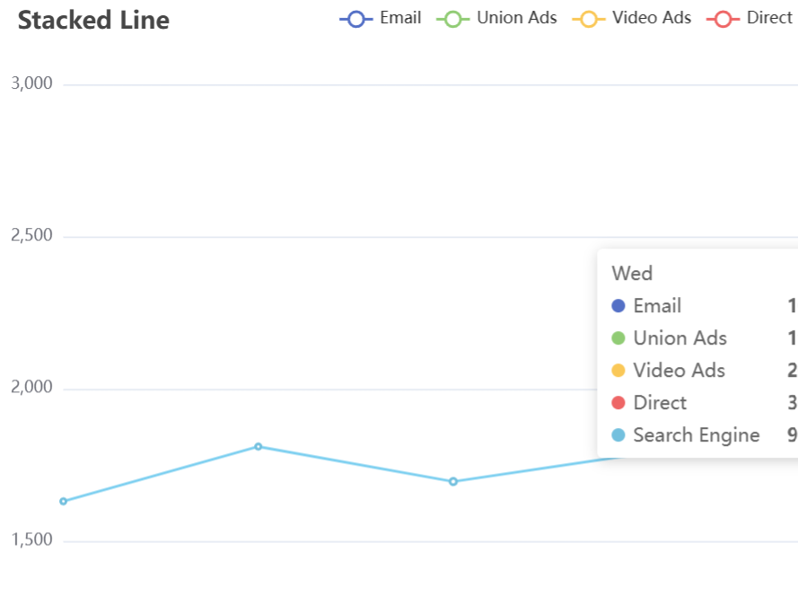
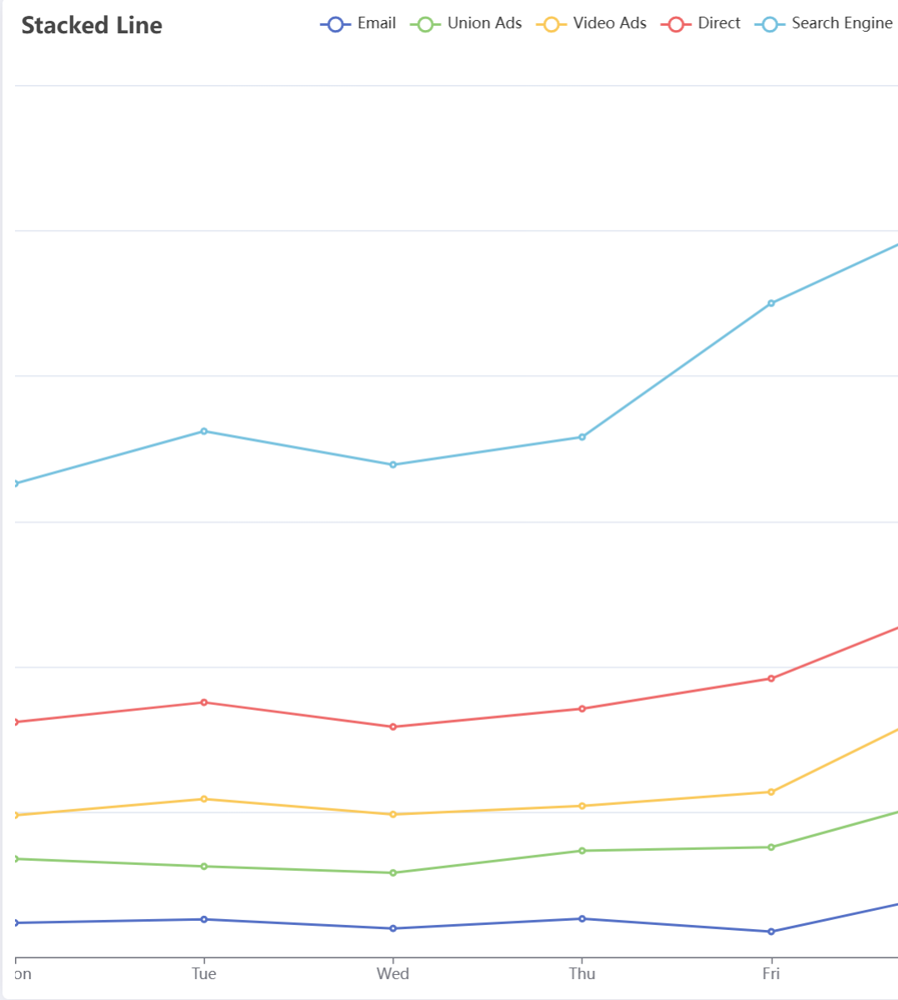
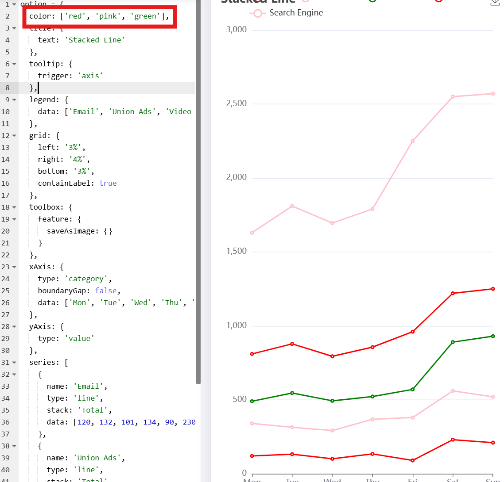
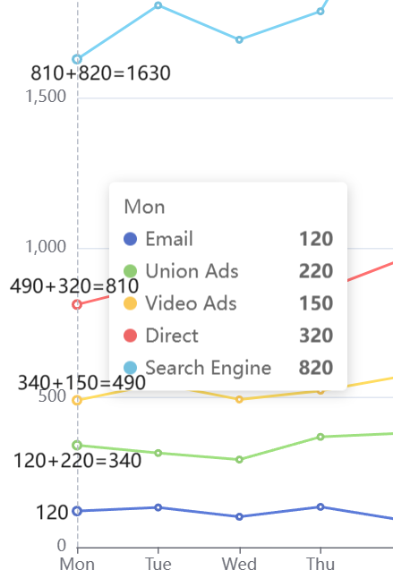
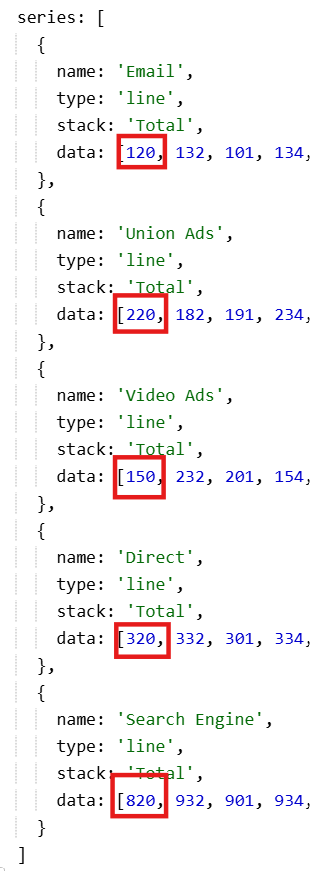
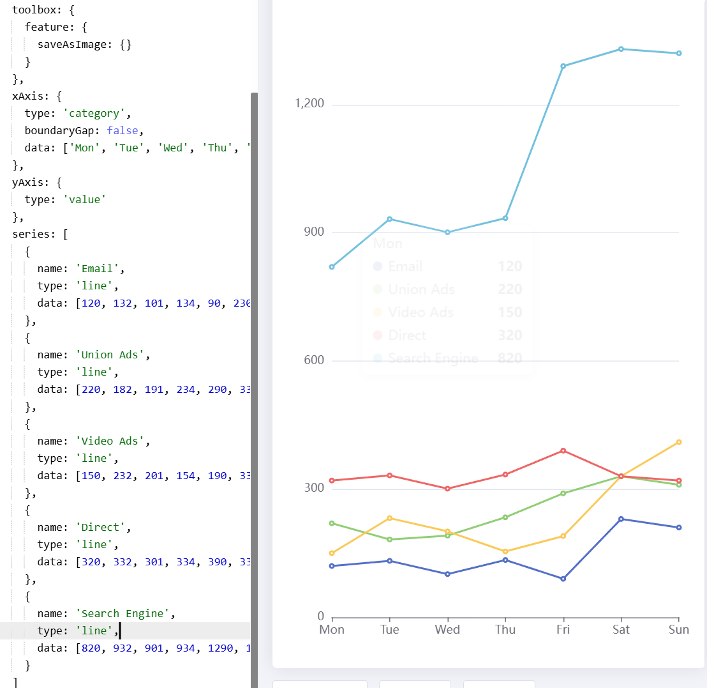

<a id="mulu">目录</a>
<a href="#mulu" class="back">回到目录</a>
<style>
    .back{width:40px;height:40px;display:inline-block;line-height:20px;font-size:20px;background-color:lightyellow;position: fixed;bottom:50px;right:50px;z-index:999;border:2px solid pink;opacity:0.3;transition:all 0.3s;color:green;}
    .back:hover{color:red;opacity:1}
    img{vertical-align:bottom;}
</style>

<!-- @import "[TOC]" {cmd="toc" depthFrom=3 depthTo=6 orderedList=false} -->

<!-- code_chunk_output -->

- [基本使用](#基本使用)
- [配置项简介](#配置项简介)
- [数据可视化项目](#数据可视化项目)

<!-- /code_chunk_output -->

<!-- 打开侧边预览：f1->Markdown Preview Enhanced: open...
只有打开侧边预览时保存才自动更新目录 -->

写在前面：本篇笔记来自b站课程[JavaScript前端课程-dom-bom-js-es6新语法-jQuery-数据可视化echarts](https://www.bilibili.com/video/BV1Sy4y1C7ha)中的echarts部分

[ECharts](https://echarts.apache.org/zh/index.html)是一个使用JS实现的开源可视化库，用于制作数据可视化图表
### 基本使用
**五个步骤**：
- 下载并引入echarts.js文件 [5.5.1版本](https://github.com/apache/echarts/blob/5.5.1/dist/echarts.min.js)
- 准备一个具有大小的dom容器
- 初始化echarts实例对象（每个图表都对应着一个实例化对象），使用`echarts.init(dom对象)`
- 指定配置项和数据（根据具体需求），以对象/字典形式，键为配置项名（标题、图例、数据等等），值即为配置项值（也是一个对象，里面有更细化的配置项）
- 将配置项设置给之前生成的示例对象，使用`echarts实例对象.setOption(option)`

```html
<!-- 一个有大小的盒子 -->
<body>
    <div class="box"></div>
</body>
<style>
    .box{
        width: 400px;
        height: 400px;
    }
</style>
<!-- 引入echarts.js -->
<script src="./echarts.min.js"></script>
<script>
    const my_echart = echarts.init(document.querySelector(".box")); //实例化echarts对象
    let option = {
        title: {
            text: 'ECharts 入门示例'
        },
        tooltip: {},
        legend: {
            data: ['销量']
        },
        xAxis: {
            data: ['衬衫', '羊毛衫', '雪纺衫', '裤子', '高跟鞋', '袜子']
        },
        yAxis: {},
        series: [
            {
                name: '销量',
                type: 'bar',
                data: [5, 20, 36, 10, 10, 20]
            }
        ]
    }; //配置项
    my_echart.setOption(option); //指定配置项
</script>
```
{:width=300 height=300}
在[官网的示例界面](https://echarts.apache.org/examples/zh/index.html)，我们可以找到更多种类的图，点击想要画的图，可以复制对应代码，同时网站也提供在线编辑代码--实时预览效果的功能
### 配置项简介
这里只简单讲解最常用的一些配置，更多配置项需要查阅官方文档，例如[配置项手册](https://echarts.apache.org/zh/option.html)
- `title`标题
- `tooltip`提示框，当鼠标放到图中数据点时出现，用于显示数据的具体内容
- `legend`图例，除了标识每种颜色代表哪种数据外，还可以设置点击图例显示/隐藏对应的线/点
- `toolbox`工具栏，例如保存图表到本地的按钮
    {:width=300 height=300}
- `grid`网格线，这里是指图表x与y轴围成的矩形的边框线（下图的红色区域），通过修改其中top、bottom、left、right的值，可以调整这个矩形与echarts容器（黄色区域）的上下左右边距
    {:width=400 height=400}
    [使用的示例](https://echarts.apache.org/examples/zh/editor.html?c=line-stack)
  - 如果left为'0%'，则说明y轴要紧贴黄色边框，此时有两种情况：
    - `grid`配置项中的`containLabel: true`属性设置grid包含x轴标签，x轴标签紧贴黄色边框，不会溢出
    {:width=200 height=200}
    - `containLabel: false`不包含x轴标签，x轴标签发生溢出而消失
    {:width=300 height=300}
- `xAxis`和`yAxis`xy轴，包括轴刻度标签取值、设置方式、间距等等
- `color`颜色，与其它配置项的值为对象不同，它的值为一个数组
    一个简单的使用：更改每条线的颜色--只需在option中添加`color: [颜色1, 颜色2, ...]`即可，当颜色数量少于线数量时，会循环使用；如果只给一种颜色，那么所有的线都会为那种颜色
    {:width=300 height=300}
- `series`设置绘图的数据，值为一个由对象组成的数组，可以简单理解为有几个对象就有几条线，该对象内包含线的名字、类型、数据等信息：
  - `type`线的类型，如`line`折线、`bar`柱形等
  - `name`线的名称，用于图例筛选、提示框内容等处
  - `data`线的数据，为一个数组，每个元素为一个数据点
  - `stack`数据堆叠，值为一个字符串，表示堆叠名称，可以理解为有相同stack的对象为一组线，在该组中，`第二个series的实际data`=`第一个series的data`+`第二个series的data`，`第三个series的实际data`=`第二个series的实际data`+`第三个series的data`，...
  以第一个点为例：
    {:width=400 height=400}{:width=400 height=400}
    **如果给stack指定不同值或去掉该属性则不会发生数据堆叠**
    {:width=500 height=500}
### 数据可视化项目

