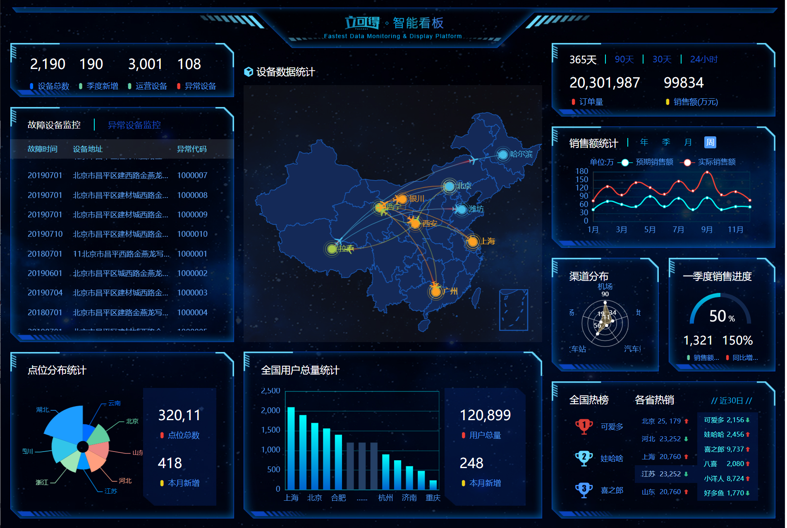
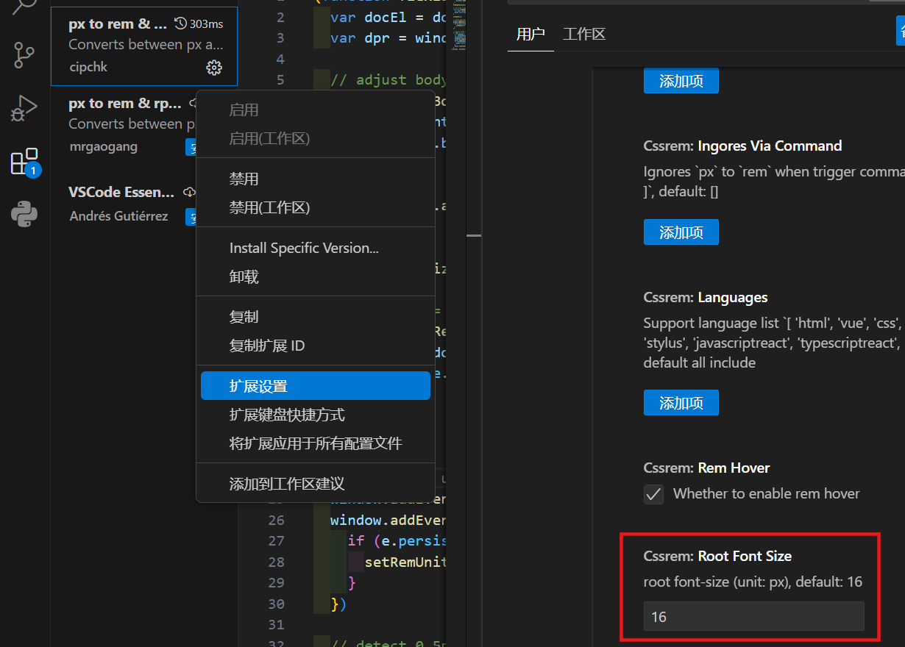
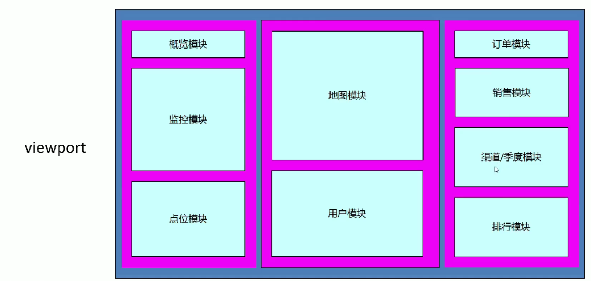
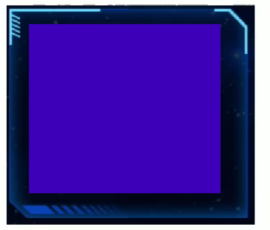
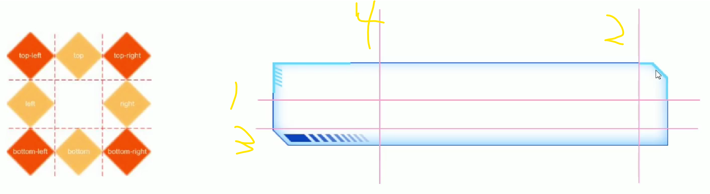
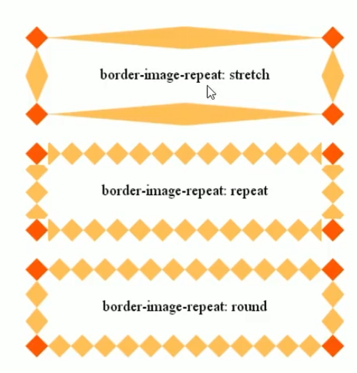

<a id="mulu">目录</a>
<a href="#mulu" class="back">回到目录</a>
<style>
    .back{width:40px;height:40px;display:inline-block;line-height:20px;font-size:20px;background-color:lightyellow;position: fixed;bottom:50px;right:50px;z-index:999;border:2px solid pink;opacity:0.3;transition:all 0.3s;color:green;}
    .back:hover{color:red;opacity:1}
    img{vertical-align:bottom;}
</style>

<!-- @import "[TOC]" {cmd="toc" depthFrom=3 depthTo=6 orderedList=false} -->

<!-- code_chunk_output -->

- [基本使用](#基本使用)
- [配置项简介](#配置项简介)
- [数据可视化项目](#数据可视化项目)
    - [PC端适配](#pc端适配)
    - [项目结构](#项目结构)
    - [项目布局](#项目布局)
      - [边框图片](#边框图片)

<!-- /code_chunk_output -->

<!-- 打开侧边预览：f1->Markdown Preview Enhanced: open...
只有打开侧边预览时保存才自动更新目录 -->

写在前面：本篇笔记来自b站课程[JavaScript前端课程-dom-bom-js-es6新语法-jQuery-数据可视化echarts](https://www.bilibili.com/video/BV1Sy4y1C7ha)中的echarts部分

[ECharts](https://echarts.apache.org/zh/index.html)是一个使用JS实现的开源可视化库，用于制作数据可视化图表
### 基本使用
**五个步骤**：
- 下载并引入echarts.js文件 [5.5.1版本](https://github.com/apache/echarts/blob/5.5.1/dist/echarts.min.js)
- 准备一个具有大小的dom容器
- 初始化echarts实例对象（每个图表都对应着一个实例化对象），使用`echarts.init(dom对象)`
- 指定配置项和数据（根据具体需求），以对象/字典形式，键为配置项名（标题、图例、数据等等），值即为配置项值（也是一个对象，里面有更细化的配置项）
- 将配置项设置给之前生成的示例对象，使用`echarts实例对象.setOption(option)`

```html
<!-- 一个有大小的盒子 -->
<body>
    <div class="box"></div>
</body>
<style>
    .box{
        width: 400px;
        height: 400px;
    }
</style>
<!-- 引入echarts.js -->
<script src="./echarts.min.js"></script>
<script>
    const my_echart = echarts.init(document.querySelector(".box")); //实例化echarts对象
    let option = {
        title: {
            text: 'ECharts 入门示例'
        },
        tooltip: {},
        legend: {
            data: ['销量']
        },
        xAxis: {
            data: ['衬衫', '羊毛衫', '雪纺衫', '裤子', '高跟鞋', '袜子']
        },
        yAxis: {},
        series: [
            {
                name: '销量',
                type: 'bar',
                data: [5, 20, 36, 10, 10, 20]
            }
        ]
    }; //配置项
    my_echart.setOption(option); //指定配置项
</script>
```
{:width=300 height=300}
在[官网的示例界面](https://echarts.apache.org/examples/zh/index.html)，我们可以找到更多种类的图，点击想要画的图，可以复制对应代码，同时网站也提供在线编辑代码--实时预览效果的功能
### 配置项简介
这里只简单讲解最常用的一些配置，更多配置项需要查阅官方文档，例如[配置项手册](https://echarts.apache.org/zh/option.html)
- `title`标题
- `tooltip`提示框，当鼠标放到图中数据点时出现，用于显示数据的具体内容
- `legend`图例，除了标识每种颜色代表哪种数据外，还可以设置点击图例显示/隐藏对应的线/点
- `toolbox`工具栏，例如保存图表到本地的按钮
    {:width=300 height=300}
- `grid`网格线，这里是指图表x与y轴围成的矩形的边框线（下图的红色区域），通过修改其中top、bottom、left、right的值，可以调整这个矩形与echarts容器（黄色区域）的上下左右边距
    {:width=400 height=400}
    [使用的示例](https://echarts.apache.org/examples/zh/editor.html?c=line-stack)
  - 如果left为'0%'，则说明y轴要紧贴黄色边框，此时有两种情况：
    - `grid`配置项中的`containLabel: true`属性设置grid包含x轴标签，x轴标签紧贴黄色边框，不会溢出
    {:width=200 height=200}
    - `containLabel: false`不包含x轴标签，x轴标签发生溢出而消失
    {:width=300 height=300}
- `xAxis`和`yAxis`xy轴，包括轴刻度标签取值、设置方式、间距等等
- `color`颜色，与其它配置项的值为对象不同，它的值为一个数组
    一个简单的使用：更改每条线的颜色--只需在option中添加`color: [颜色1, 颜色2, ...]`即可，当颜色数量少于线数量时，会循环使用；如果只给一种颜色，那么所有的线都会为那种颜色
    {:width=300 height=300}
- `series`设置绘图的数据，值为一个由对象组成的数组，可以简单理解为有几个对象就有几条线，该对象内包含线的名字、类型、数据等信息：
  - `type`线的类型，如`line`折线、`bar`柱形等
  - `name`线的名称，用于图例筛选、提示框内容等处
  - `data`线的数据，为一个数组，每个元素为一个数据点
  - `stack`数据堆叠，值为一个字符串，表示堆叠名称，可以理解为有相同stack的对象为一组线，在该组中，`第二个series的实际data`=`第一个series的data`+`第二个series的data`，`第三个series的实际data`=`第二个series的实际data`+`第三个series的data`，...
  以第一个点为例：
    {:width=400 height=400}{:width=400 height=400}
    **如果给stack指定不同值或去掉该属性则不会发生数据堆叠**
    {:width=500 height=500}
### 数据可视化项目
{:width=500 height=500}
基本尺寸大小为1920px
##### PC端适配
即窗口宽度在1024-1920px间时，需要页面元素宽高自适应
- 使用[flexible.js](https://github.com/amfe/lib-flexible)检测浏览器宽度，同时修改页面文字大小
- 使用rem单位，配合vscode中的`cssrem`插件（[使用教程](https://www.cnblogs.com/ldq678/p/13424090.html)）
- flex布局
- vscode中的`preview on web server`插件，实现.html文件更改保存后自动刷新页面（.html文件中右键->`vscode-preview-server:Launch on browser`或`CTRL+shift+L`），省去了手动点击浏览器刷新按钮的步骤

具体方法：通过flexible.js将屏幕分成24等份，cssrem插件基准值为1920÷24=80px（即80px对应1rem）
- 修改`flexible.js`中
    ```js
    // set 1rem = viewWidth / 10
    function setRemUnit() {
        var rem = docEl.clientWidth / 10
        docEl.style.fontSize = rem + 'px'
    }
    ```
    的10为24：
    ```js
    // set 1rem = viewWidth / 24
    function setRemUnit() {
        var rem = docEl.clientWidth / 24
        docEl.style.fontSize = rem + 'px'
    }
    ```
- 找到cssrem的扩展设置，修改Cssrem: Root Font Size为80
    {:width=300 height=300}
    这样我们在写CSS时，输入200px，就会自动出现`200px->2.5rem`的提示
- 约束屏幕宽度为1024-1920：使用媒体查询，指定最小最大宽度及对应的字体尺寸
##### 项目结构
```
.
├── css
│   ├── common.css 清除默认样式
│   └── index.css 项目的主要CSS
├── fonts 字体
├── images 图片
├── js
│   ├── echarts.min.js 
│   ├── flexible.js
│   ├── jquery.min.js
│   └── index.js 项目的主要JS
└── index.html 项目主网页
```
##### 项目布局
- 整个页面都有背景图片：给body设置bgi，不重复，且跟随屏幕一起缩放(`background-size: cover`)
- 先设置一个最大的盒子`.viewport`，指定最大最小宽度并居中对齐(`margin: 0 auto`)，将最上方的智能看板图标作为它的背景图片，其中再包含三列`.column`，使用flex设置各列的比例为3:4:3
    {:width=200 height=200}
- 每个小盒子的边框：使用[边框图片](#边框图片)`border-image`属性，适用于盒子大小不同、但边框样式相同的场景
    {:width=200 height=200}
###### 边框图片
**边框图片的切图原理**：把4个角切出去，中间部分可以拉伸/铺排/环绕，分成了9部分。切的时候按右上角->右下角->左下角->左上角的顺时针顺序
{:width=200 height=200}
**边框图片的语法**：
| 属性                | 描述                                                 |
| ------------------- | ---------------------------------------------------- |
| border-image-source | 图片路径                                             |
| border-image-slice  | 图片边框向内偏移（裁剪尺寸，不加单位，上右下左的顺序 |
| border-image-width  | 边框图片的宽度（有单位），默认等于边框宽度border     |
| border-image-repeat | 是否平铺(repeat)、铺满(round)、默认拉伸(stretch)     |

**上右下左的顺序**：即上图的第1条线距上边的距离、第2条线距右边的距离、第3条线距下边的距离、第4条线距左边的距离
**`border-image-width`与border宽度的区别**：增大border，盒子内元素会向内被挤压，而`border-image-width`不会挤压盒子内元素，相当于背景图片的作用
**平铺、铺满与拉伸**：当盒子的中间部分长度大于边框图片中间部分时，边框图片的中间部分会重复以覆盖盒子的中间部分。拉伸就是拉伸边框图片的中间部分，不重复；铺满允许每个中间部分重叠，以完整显示每个中间部分；平铺不允许重叠，可能出现两侧的中间部分显示不全：
{:width=300 height=300}
