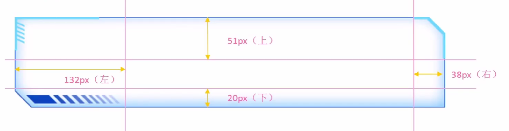
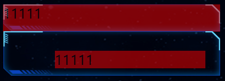
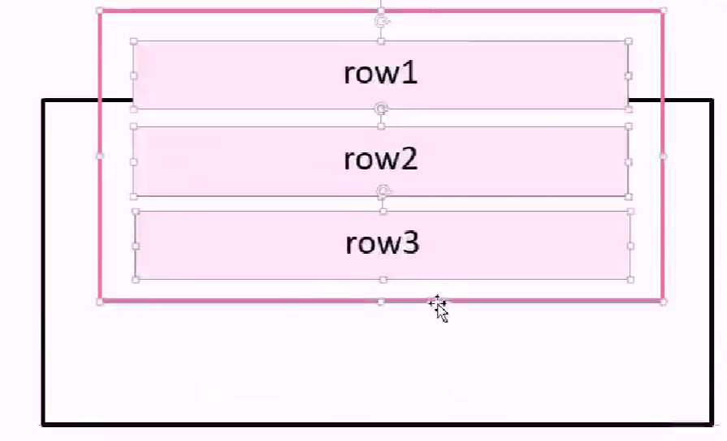
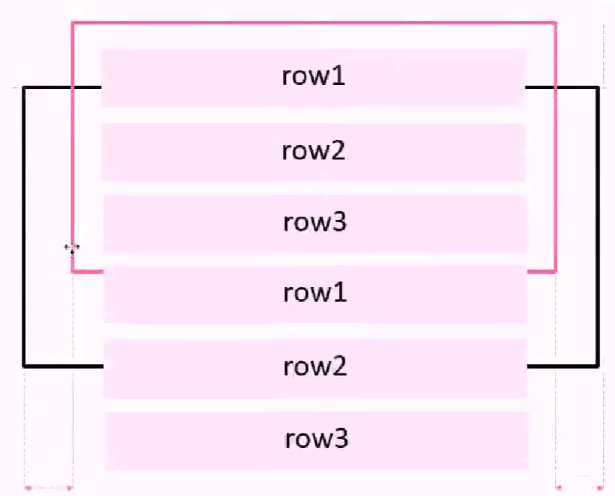
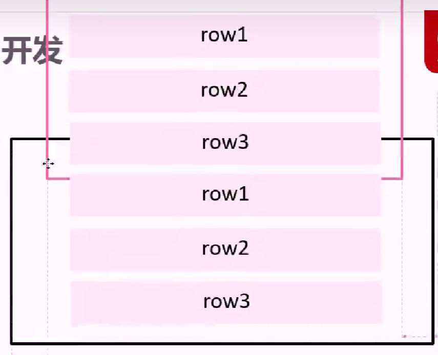
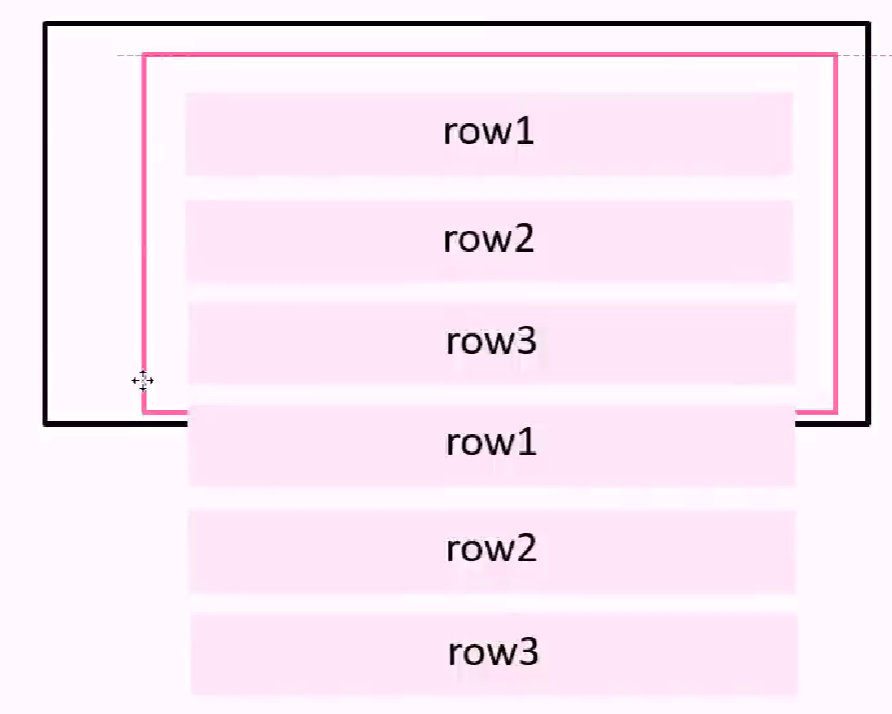
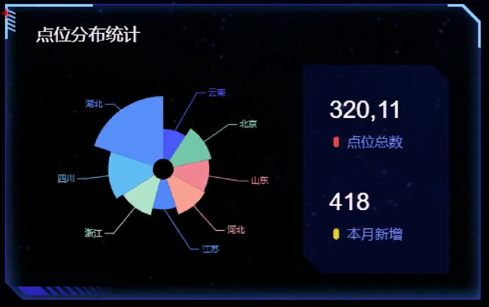
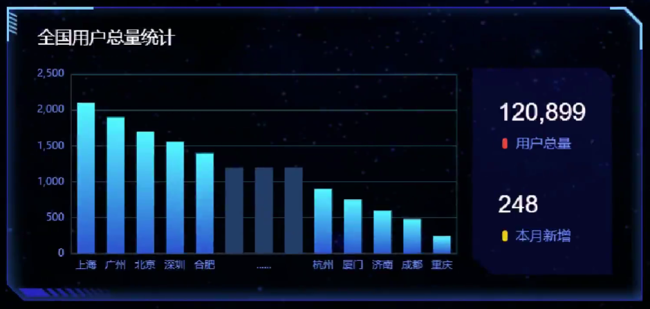

<a id="mulu">目录</a>
<a href="#mulu" class="back">回到目录</a>
<style>
    .back{width:40px;height:40px;display:inline-block;line-height:20px;font-size:20px;background-color:lightyellow;position: fixed;bottom:50px;right:50px;z-index:999;border:2px solid pink;opacity:0.3;transition:all 0.3s;color:green;}
    .back:hover{color:red;opacity:1}
    img{vertical-align:bottom;}
</style>

<!-- @import "[TOC]" {cmd="toc" depthFrom=3 depthTo=6 orderedList=false} -->

<!-- code_chunk_output -->

- [基本使用](#基本使用)
- [配置项简介](#配置项简介)
- [数据可视化项目](#数据可视化项目)
    - [PC端适配](#pc端适配)
    - [项目结构](#项目结构)
    - [项目布局](#项目布局)
      - [总体布局](#总体布局)
      - [边框图片](#边框图片)
      - [公共面板](#公共面板)
      - [概览区域overview](#概览区域overview)
      - [监控区域monitor](#监控区域monitor)
      - [点位分布统计point--玫瑰图](#点位分布统计point-玫瑰图)
      - [设备数据统计map--地图](#设备数据统计map-地图)
      - [全国用户总量统计users--柱状图](#全国用户总量统计users-柱状图)

<!-- /code_chunk_output -->

<!-- 打开侧边预览：f1->Markdown Preview Enhanced: open...
只有打开侧边预览时保存才自动更新目录 -->

写在前面：本篇笔记来自b站课程[JavaScript前端课程-dom-bom-js-es6新语法-jQuery-数据可视化echarts](https://www.bilibili.com/video/BV1Sy4y1C7ha)中的echarts部分

[ECharts](https://echarts.apache.org/zh/index.html)是一个使用JS实现的开源可视化库，用于制作数据可视化图表
### 基本使用
**五个步骤**：
- 下载并引入echarts.js文件 [5.5.1版本](https://github.com/apache/echarts/blob/5.5.1/dist/echarts.min.js)
- 准备一个具有大小的dom容器
- 初始化echarts实例对象（每个图表都对应着一个实例化对象），使用`echarts.init(dom对象)`
- 指定配置项和数据（根据具体需求），以对象/字典形式，键为配置项名（标题、图例、数据等等），值即为配置项值（也是一个对象，里面有更细化的配置项）
- 将配置项设置给之前生成的示例对象，使用`echarts实例对象.setOption(option)`

```html
<!-- 一个有大小的盒子 -->
<body>
    <div class="box"></div>
</body>
<style>
    .box{
        width: 400px;
        height: 400px;
    }
</style>
<!-- 引入echarts.js -->
<script src="./echarts.min.js"></script>
<script>
    const my_echart = echarts.init(document.querySelector(".box")); //实例化echarts对象
    let option = {
        title: {
            text: 'ECharts 入门示例'
        },
        tooltip: {},
        legend: {
            data: ['销量']
        },
        xAxis: {
            data: ['衬衫', '羊毛衫', '雪纺衫', '裤子', '高跟鞋', '袜子']
        },
        yAxis: {},
        series: [
            {
                name: '销量',
                type: 'bar',
                data: [5, 20, 36, 10, 10, 20]
            }
        ]
    }; //配置项
    my_echart.setOption(option); //指定配置项
</script>
```
{:width=300 height=300}
在[官网的示例界面](https://echarts.apache.org/examples/zh/index.html)，我们可以找到更多种类的图，点击想要画的图，可以复制对应代码，同时网站也提供在线编辑代码--实时预览效果的功能
### 配置项简介
这里只简单讲解最常用的一些配置，更多配置项需要查阅官方文档，例如[配置项手册](https://echarts.apache.org/zh/option.html)
- `title`标题
- `tooltip`提示框，当鼠标放到图中数据点时出现，用于显示数据的具体内容
- `legend`图例，除了标识每种颜色代表哪种数据外，还可以设置点击图例显示/隐藏对应的线/点
- `toolbox`工具栏，例如保存图表到本地的按钮
    {:width=300 height=300}
- `grid`网格线，这里是指图表x与y轴围成的矩形的边框线（下图的红色区域），通过修改其中top、bottom、left、right的值，可以调整这个矩形与echarts容器（黄色区域）的上下左右边距
    {:width=400 height=400}
    [使用的示例](https://echarts.apache.org/examples/zh/editor.html?c=line-stack)
  - 如果left为'0%'，则说明y轴要紧贴黄色边框，此时有两种情况：
    - `grid`配置项中的`containLabel: true`属性设置grid包含x轴标签，x轴标签紧贴黄色边框，不会溢出
    {:width=200 height=200}
    - `containLabel: false`不包含x轴标签，x轴标签发生溢出而消失
    {:width=300 height=300}
- `xAxis`和`yAxis`xy轴，包括轴刻度标签取值、设置方式、间距等等
- `color`颜色，与其它配置项的值为对象不同，它的值为一个数组
    一个简单的使用：更改每条线的颜色--只需在option中添加`color: [颜色1, 颜色2, ...]`即可，当颜色数量少于线数量时，会循环使用；如果只给一种颜色，那么所有的线都会为那种颜色
    {:width=300 height=300}
- `series`设置绘图的数据，值为一个由对象组成的数组，可以简单理解为有几个对象就有几条线，该对象内包含线的名字、类型、数据等信息：
  - `type`线的类型，如`line`折线、`bar`柱形等
  - `name`线的名称，用于图例筛选、提示框内容等处
  - `data`线的数据，为一个数组，每个元素为一个数据点
  - `stack`数据堆叠，值为一个字符串，表示堆叠名称，可以理解为有相同stack的对象为一组线，在该组中，`第二个series的实际data`=`第一个series的data`+`第二个series的data`，`第三个series的实际data`=`第二个series的实际data`+`第三个series的data`，...
  以第一个点为例：
    {:width=400 height=400}{:width=400 height=400}
    **如果给stack指定不同值或去掉该属性则不会发生数据堆叠**
    {:width=500 height=500}
### 数据可视化项目
{:width=500 height=500}
基本尺寸大小为1920px
##### PC端适配
即窗口宽度在1024-1920px间时，需要页面元素宽高自适应
- 使用[flexible.js](https://github.com/amfe/lib-flexible)检测浏览器宽度，同时修改页面文字大小
- 使用rem单位，配合vscode中的`cssrem`插件（[使用教程](https://www.cnblogs.com/ldq678/p/13424090.html)）
- flex布局
- vscode中的`preview on web server`插件，实现.html文件更改保存后自动刷新页面（.html文件中右键->`vscode-preview-server:Launch on browser`或`CTRL+shift+L`），省去了手动点击浏览器刷新按钮的步骤

具体方法：通过flexible.js将屏幕分成24等份，cssrem插件基准值为1920÷24=80px（即80px对应1rem）
- 修改`flexible.js`中
    ```js
    // set 1rem = viewWidth / 10
    function setRemUnit() {
        var rem = docEl.clientWidth / 10
        docEl.style.fontSize = rem + 'px'
    }
    ```
    的10为24：
    ```js
    // set 1rem = viewWidth / 24
    function setRemUnit() {
        var rem = docEl.clientWidth / 24
        docEl.style.fontSize = rem + 'px'
    }
    ```
- 找到cssrem的扩展设置，修改Cssrem: Root Font Size为80
    {:width=300 height=300}
    这样我们在写CSS时，输入200px，就会自动出现`200px->2.5rem`的提示
- 约束屏幕宽度为1024-1920：使用媒体查询，指定最小最大宽度及对应的字体尺寸
##### 项目结构
```
.
├── css
│   ├── common.css 清除默认样式
│   └── index.css 项目的主要CSS
├── fonts 字体
├── images 图片
├── js
│   ├── echarts.min.js 
│   ├── flexible.js
│   ├── jquery.min.js
│   └── index.js 项目的主要JS
└── index.html 项目主网页
```
##### 项目布局
###### 总体布局
- 整个页面都有背景图片：给body设置bgi，不重复，且跟随屏幕一起缩放(`background-size: cover`)
- 先设置一个最大的盒子`.viewport`，指定最大最小宽度并居中对齐(`margin: 0 auto`)，将最上方的智能看板图标作为它的背景图片，其中再包含三列`.column`，使用flex设置各列的比例为3:4:3
    {:width=200 height=200}
- 每个小盒子的边框：使用[边框图片](#边框图片)`border-image`属性，适用于盒子大小不同、但边框样式相同的场景
    {:width=200 height=200}
###### 边框图片
**边框图片的切图原理**：把4个角切出去，中间部分可以拉伸/铺排/环绕，分成了9部分。切的时候按右上角->右下角->左下角->左上角的顺时针顺序
{:width=200 height=200}
**边框图片的语法**：
| 属性                | 描述                                                 |
| ------------------- | ---------------------------------------------------- |
| border-image-source | 图片路径                                             |
| border-image-slice  | 图片边框向内偏移（裁剪尺寸，不加单位，上右下左的顺序 |
| border-image-width  | 边框图片的宽度（有单位），默认等于边框宽度border     |
| border-image-repeat | 是否平铺(repeat)、铺满(round)、默认拉伸(stretch)     |

**上右下左的顺序**：即上图的第1条线距上边的距离、第2条线距右边的距离、第3条线距下边的距离、第4条线距左边的距离
**`border-image-width`与border宽度的区别**：增大border，盒子内元素会向内被挤压，而`border-image-width`不会挤压盒子内元素，相当于背景图片的作用
**平铺、铺满与拉伸**：当盒子的中间部分长度大于边框图片中间部分时，边框图片的中间部分会重复以覆盖盒子的中间部分。拉伸就是拉伸边框图片的中间部分，不重复；铺满允许每个中间部分重叠，以完整显示每个中间部分；平铺不允许重叠，可能出现两侧的中间部分显示不全：
{:width=300 height=300}
###### 公共面板
在本项目中，使用`.panel`作为公共面板，给它加上边框图片
{:width=200 height=200}
- 设置边框宽度`border-width`或边框图片宽度`border-image-width`为51 38 20 132px（实际要转换成rem单位）。因为后面还要使用子盒子定位，这里无所谓
- 设置切分属性`border-image-slice`为51 38 20 132（不加单位）

```css
.panel {
    border: 15px solid transparent;
    /* border-image-width: .6375rem .475rem .25rem 1.65rem; */
    border-width: .6375rem .475rem .25rem 1.65rem;
    border-image-source: url(../images/border.png);
    border-image-slice: 51 38 20 132;
}
```
为了使图表显示不受`.panel`边框的影响，在`.panel`中再设置一个盒子`.inner`作为装图表的真正盒子。使用子绝父相来使子盒子与父盒子重叠，注意这里不是设置top/left/right/bottom=0（因为top和left是距边框的距离），而是`top`=-`上边框宽度`、`left`=-`左边框宽度`、...
```css
.panel .inner {
    /* 子绝父相 */
    position: absolute;
    top: -0.6375rem;
    left: -1.65rem;
    right: -0.475rem;
    bottom: -0.25rem;
    /* 如果上面使用的是border-image-width，此处应为： */
    /* top: -15px;
    left: -15px;
    right: -15px;
    bottom: -15px; */
}
```
设置`.inner`与直接在`.panel`中写内容的对比：
{:width=200 height=200}
这样做的缺点：`.panel`无法靠其内容`.inner`撑开，需要单独指定`.panel`高度（宽度继承`.column`）
之后我们可以根据具体需要，为`.inner`添加padding，使其内容不紧贴边框
其它盒子边距这里不再详细说明
###### 概览区域overview
{:width=200 height=200}
注意：为统一格式，所有的区域类名都加在`.panel`上，内容都在`.inner`中写
采用`ul`>`li`>`h4`+`span`>`i.字体图标`+`文字`的布局，flex布局使li横向，space-between分配间距
```html
<div class="panel overview">
    <div class="inner">
        <ul>
            <li>
                <h4>2,190</h4>
                <span>
                    <i class="icon-dot" style="color: #006cff;"></i>
                    设备总数
                </span>
            </li>
            <li>
                <h4>190</h4>
                <span>
                    <i class="icon-dot" style="color: #6acca3;"></i>
                    季度新增
                </span>
            </li>
            <li>
                <h4>3,001</h4>
                <span>
                    <i class="icon-dot" style="color: #6acca3;"></i>
                    运营设备
                </span>
            </li>
            <li>
                <h4>108</h4>
                <span>
                    <i class="icon-dot" style="color: #ed3f35;"></i>
                    异常设备
                </span>
            </li>
        </ul>
    </div>
</div>
```
```css
.overview {
    height: 1.375rem;
}
.overview ul {
    display: flex;
    justify-content: space-between;
}
.overview ul li h4 {
    font-size: .35rem;
    color: #fff;
    margin-left: .06rem;
    margin-bottom: .1rem;
}
.overview ul li span {
    font-size: .2rem;
    color: #4c9bfd;
}
```
###### 监控区域monitor
{:width=200 height=200}
上面的故障设备监控和异常设备监控是tab栏切换，于是分为`.inner`>`.tabs`+`.content`，需要两个`.content`，tab栏切换时让其中一个隐藏而另一个显示
`.content`分为上面的标题`.head`和滚动部分`.marquee-view`，两个区域使用子绝父相固定，均使用flex布局使各子标签横向排列

---

重点：滚动效果--每行持续滚动，鼠标放上去时停止
HTML结构：
```html
<div class="marquee-view">
    <div class="marquee">
        <div class="row">row1</div>
        <div class="row">row2</div>
        <div class="row">row3</div>
    </div>
</div>
```
我们在滚动时，是让`.marquee-view`（黑色边框盒子）固定，作为展示窗口，而`.marquee`（粉色边框盒子）进行滚动。正常情况下，当`.marquee`滚动到一定位置后，底部会出现空白：
{:width=150 height=150}
需要将这些行再复制一份，接到后面，让滚动无缝（即让内容占满整个`.marquee-view`）
{:width=200 height=200}
当滚动了一组row123后（50%高度），添加的行（新row123）展示在`.marquee-view`中，此时让`.marquee`复原到初始位置（保持`.marquee-view`中仍是row123），开始下一次滚动
{:width=200 height=200}{:width=200 height=200}
具体实现：
- 先复制`.marquee`中所有的行
- 通过CSS动画滚动，因为动画可以自动从头播放，无需手动将`.marquee`复原到初始位置
- 鼠标经过就停止动画

```js
const marquee = $(".marquee-view .marquee"); //要滚动的区域（共两个）
marquee.each(function(){ //使用each遍历
    const new_row = $(this).children().clone(); //复制所有的行（marquee子元素）
    $(this).append(new_row); //添加到marquee中
});
```
```css
@keyframes move {
    0% {}

    100% {
        transform: translateY(-50%);
        /* 注意是负数 */
    }
}

.monitor .marquee-view .marquee {
    animation: move 15s linear infinite;
    /* 持续15s，匀速，无限循环 */
}

.monitor .marquee-view .marquee:hover {
    animation-play-state: paused;
    /* 鼠标经过暂停动画 */
}
```
###### 点位分布统计point--玫瑰图
{:width=200 height=200}
`.inner`>标题`h3`+内容`.chart`>饼形图`.pie`+文字`.date`

---

通过查询[官方示例中的饼图](https://echarts.apache.org/examples/zh/index.html#chart-type-pie)，可以看到这是一个[南丁格尔玫瑰图](https://echarts.apache.org/examples/zh/editor.html?c=pie-roseType)
在其基础上进行初步修改：
- 去掉图例、标题、工具箱
- 修改series数据：例子中有两个图，我们只需要一个，删掉series中第一个对象即可

```js
option = {
  tooltip: {
    trigger: 'item',
    formatter: '{a} <br/>{b} : {c} ({d}%)'
  },
  series: [
    {
      name: 'Area Mode',
      type: 'pie',
      radius: [20, 140],
      center: ['75%', '50%'],
      roseType: 'area',
      data: [
        { value: 30, name: 'rose 1' },
        { value: 28, name: 'rose 2' },
        { value: 26, name: 'rose 3' },
        { value: 24, name: 'rose 4' },
        { value: 22, name: 'rose 5' },
        { value: 20, name: 'rose 6' },
        { value: 18, name: 'rose 7' },
        { value: 16, name: 'rose 8' }
      ]
    }
  ]
};
```
其中各参数含义：
- `tooltip`鼠标移入图表各部分时出现的提示框
  - `trigger`出现提示框的触发方式，`'item'`就是放到图形上触发，还有`'axis'`为坐标轴触发（柱状图、折线图常用）和`'none'`不触发
  - `formatter`指定提示内容
    - `a`图表名称(series-name)
    - `b`数据名称(series-data-name)
    - `c`数据值(series-data-value)
    - `d`当前数据占总数据的比例
- `series`数据
  - `name`图表名称
  - `type`图表类型
  - `radius:[inner, outer]`饼形图内/外半径，可以是百分比（基于容器盒子大小），也可以是像素
    注意：如果使用百分比，必须加引号
  - `center:[left, top]`图表中心位置距容器盒子左/上距离
  - `roseType`扇形的显示模式，即用什么表示数据值，分为`'radius'`用扇形**半径**表示和`'area'`用扇形**面积**表示
  - `data`每个扇形（数据项）的名称和取值

如何调整：
- 修改颜色：在option中添加`color:[颜色1, 颜色2, ...]`
- 让图表在盒子正中间：`center: ['50%', '50%']`
- 修改大小：`radius: ['10%', '80%']`
- 修改显示模式：`roseType: 'radius'`
- 修改series中data为自己的数据

为了防止缩放后字体、字体与扇形的连接线超出范围，需要修改series中`label`和`labelLine`属性（以对象形式），其中`label`控制所有文字相关的样式，`labelLine`控制连接线样式：
- 缩小字体：`label: { fontSize: 10 }`
- 缩短连接线：`labelLine: { length: 6, length2: 8 }`，其中`length`是连接线中连接扇形的线长度，`length2`是连接文字的线长度

如何让缩放页面窗口时，图表能自动调整大小：为窗口`window`增加`resize`事件，调用`my_echart`对象的`resize()`方法
经过调整后的完整js代码：
```js
const my_echart = echarts.init(document.querySelector(".point .pie")); //实例化echarts对象
let option = {
    tooltip: {
        trigger: 'item',
        formatter: '{a} <br/>{b} : {c} ({d}%)'
    },
    color: [
        "#006cff",
        "#60cda0",
        "#ed8884",
        "#ff9f7f",
        "#0096ff",
        "#9fe6b8",
        "#32c5e9",
        "#1d9dff"
    ],
    series: [
        {
            name: '点位统计',
            type: 'pie',
            radius: ['10%', '80%'],
            center: ['50%', '50%'],
            roseType: 'radius',
            data: [
                { value: 20, name: "云南" },
                { value: 26, name: "北京" },
                { value: 24, name: "山东" },
                { value: 25, name: "河北" },
                { value: 20, name: "江苏" },
                { value: 25, name: "浙江" },
                { value: 30, name: "四川" },
                { value: 42, name: "湖北" }
            ],
            label: {
                fontSize: 10,
            },
            labelLine: {
                length: 6,
                length2: 8
            }
        }
    ]
}; //配置项
my_echart.setOption(option); //指定配置项
window.addEventListener("resize", function () { //窗口尺寸改变，刷新图表大小
    my_echart.resize();
});
```
###### 设备数据统计map--地图
{:width=400 height=400}
`.inner`>`h3`标题+`.chart`地图

######  全国用户总量统计users--柱状图
{:width=300 height=300}
标签结构与[点位分布统计point](#点位分布统计point)模块类似，这里不再重复说明
使用[官方示例中的柱状图](https://echarts.apache.org/examples/zh/index.html#chart-type-bar)中的[坐标轴刻度与标签对齐](https://echarts.apache.org/examples/zh/editor.html?c=bar-tick-align)模板
进行调整：
- 线性渐变颜色：修改color属性，有两种方式--
  - `echarts.graphic.LinearGradient`对象（常用）
    ```js
    color: new echarts.graphic.LinearGradient(
        x1, y1, x2, y2,  //从(x1,y1)->(x2,y2)进行渐变
        [
            { offset: 0, color: '颜色1' }, //起始颜色
            { offset: 1, color: '颜色2' } //结束颜色
        ]
    )
    ```
  - `type: 'linear'`
    ```js
    color: {
        type: 'linear',
        x: x1,
        y: y1,
        x2: x2,
        y2: y2, //从(x1,y1)->(x2,y2)进行渐变
        colorStops: [
            { offset: 0, color: '颜色1' }, //起始颜色
            { offset: 1, color: '颜色2' } //结束颜色
        ]
    }
    ```
- 仅当鼠标进入柱子时触发提示框，且没有阴影等效果
  - 修改tooltip中的trigger为`'item'`
  - 删去tooltip中的axisPointer属性，该属性设置鼠标在坐标轴上也触发，其中的type属性设置提示框是线`'line'`还是阴影`'shadow'`

  ```js
  tooltip: {
      trigger: 'item',
  }
  ```
- 调整大小：修改grid中的left/top/right/bottom
- 显示坐标系矩阵的4条边框，并修改其颜色：修改grid中的show和borderColor
    ```js
    grid: {
        left: '0%',
        right: '3%',
        bottom: '3%',
        top: '3%',
        containLabel: true, //要显示刻度，不能溢出
        show: true, //显示坐标系矩阵边框
        borderColor: 'rgba(0, 240, 255, 0.3)' //设置边框颜色
    }
    ```
